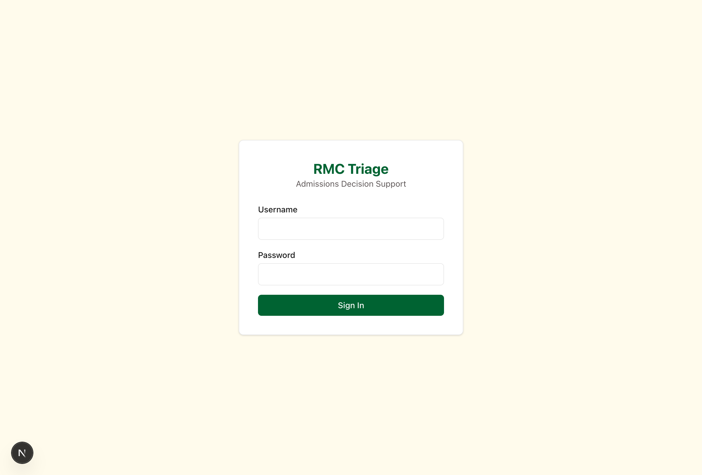

# RMC Triage UI/UX Walkthrough

## Design System

**Rush Medical College Brand Colors:**
- **Legacy Green** `#006332` — Primary actions, navigation
- **Vitality Green** `#5FEEA2` — Active states, success highlights
- **Sage** `#DFF9EB` — Subtle backgrounds
- **Purple** `#694FA0` — Warnings, Tier 1
- **Rose** `#FDE0DF` — Errors, flags
- **Ivory** `#FFFBEC` — Page background (warm, professional)

**Typography:** Calibre font family (clean, medical-friendly)

---

## Page-by-Page Tour

### 1. 🔐 Login Page (`/login`)

**Current Screenshot**: 

**Features:**
- Clean centered card on ivory background
- "RMC Triage" in Legacy Green
- Username and password fields
- "Sign In" button (full-width, green)
- Auto-redirects if already logged in
- Returns to intended page after login (via `returnTo` query param)

**Credentials** (development):
- `admin` / `admin` (admin role)
- `staff` / `staff` (staff role)

---

### 2. 📊 Dashboard (`/`)

**Layout:**
```
┌────────────────────────────────────────────┐
│  Sidebar  │  Dashboard                     │
│           │                                 │
│  [Active] │  ┌──────┬──────┬──────┬──────┐ │
│           │  │ Total│ Avg  │Agree-│Models│ │
│           │  │ Apps │Confid│ ment │Load  │ │
│           │  └──────┴──────┴──────┴──────┘ │
│           │                                 │
│           │  ┌─────────────────────────┐   │
│           │  │ Tier Distribution Chart │   │
│           │  │  [Bar chart showing     │   │
│           │  │   Tier 0,1,2,3 counts]  │   │
│           │  └─────────────────────────┘   │
│           │                                 │
│           │  ┌─────────────────────────┐   │
│           │  │ Model Bakeoff Table     │   │
│           │  │  Config | Model | Acc   │   │
│           │  │  ...performance metrics │   │
│           │  └─────────────────────────┘   │
└────────────────────────────────────────────┘
```

**4 Stats Cards:**
- Total Applicants (2024 test set)
- Avg Confidence (%)
- Agreement Rate (Clf/Reg)
- Models Loaded (count + names)

**Visual:** Clean card-based layout with metrics

---

### 3. 📤 Ingest/Upload (`/ingest`)

**Layout: Two Columns**

**Left (Upload Wizard):**
```
┌──────────────────────────┐
│ Cycle Year: [2026 ▼]    │
│                          │
│ ┌────────────────────┐   │
│ │  [Upload Icon]     │   │
│ │  Drag & drop .xlsx │   │
│ │  or click to browse│   │
│ │  Max 50MB per file │   │
│ └────────────────────┘   │
│                          │
│ [File 1.xlsx] 4.2 MB [X] │
│ [File 2.xlsx] 2.1 MB [X] │
│                          │
│ [Upload & Validate (2)]  │
└──────────────────────────┘
```

**Right (Checklist):**
```
┌──────────────────────────┐
│ Expected Files           │
│                          │
│ * applicants             │
│ * experiences            │
│   personal_statement     │
│   secondary_application  │
│   gpa_trend              │
│   ... (12 total types)   │
└──────────────────────────┘
```

**Bottom (History Table):**
- Date | Cycle Year | Status badge | Actions (Preview/Status)

**Visual States:**
- **Drag over**: Green border + sage background
- **Uploading**: Spinner + "Uploading..." text
- **Active pipeline**: Disabled with warning message

---

### 4. 👁️ Preview Page (`/ingest/{sessionId}/preview`)

**Top Section — Validation Results:**
```
✓ Success (green)    3 required files detected
⚠ Warning (amber)    Missing optional file: military.xlsx
✕ Error (red)        Applicants.xlsx: Missing column Amcas_ID
ℹ Info (blue)        Detected 1,234 applicants
```

**File List (Expandable):**
```
[📊] 1. Applicants.xlsx
     applicants • 1,234 rows • 15 columns        [▼]

     ┌─────────────────────────────────────┐
     │ Amcas_ID | Name      | GPA  | MCAT │
     │ 12345    | (redacted)| 3.85 | 518  │
     │ 12346    | (redacted)| 3.92 | 522  │
     └─────────────────────────────────────┘

[📊] 2. Experiences.xlsx
     experiences • 15,234 rows • 8 columns       [>]
```

**Bottom:**
```
[Approve & Run Pipeline] (green button)
```

**Disabled if**: Validation errors exist

---

### 5. ⏳ Pipeline Status (`/ingest/{sessionId}/status`)

**Progress Display:**
```
┌──────────────────────────────────┐
│ Pipeline Status                  │
│                                  │
│ Current Step: ML Scoring         │
│ Progress: 70%                    │
│ ████████████████░░░░░░░░         │
│                                  │
│ Status: [Running] (amber badge)  │
│                                  │
│ Steps:                           │
│ ✓ Ingestion (0-10%)              │
│ ✓ Feature Engineering (10-40%)   │
│ ⟳ ML Scoring (40-80%) [current]  │
│ ○ Triage Assignment (80-100%)    │
└──────────────────────────────────┘
```

**Auto-refresh**:
- Every 3 seconds during active steps
- Every 60 seconds during long LLM scoring
- Redirects to `/applicants` on completion
- Shows **[Retry]** button on failure

---

### 6. 👥 Applicants List (`/applicants`)

**Filters Bar:**
```
[Search AMCAS ID...] [Tier: All ▼] 613 applicants [✓] Show all tiers
```

**Table:**
```
┌──────┬──────────┬─────────────────┬───────┬──────────┬────────┐
│ Rank │ AMCAS ID │ Tier            │ Score │ Confid.  │ Agree  │
├──────┼──────────┼─────────────────┼───────┼──────────┼────────┤
│  1   │ 13149516 │ [Tier 3: Pri...]│ 22.3  │  94%     │  Yes   │
│  2   │ 13042187 │ [Tier 3: Pri...]│ 21.8  │  91%     │  Yes   │
│  3   │ 13156234 │ [Tier 2: Str...]│ 18.5  │  87%     │  No    │
└──────┴──────────┴─────────────────┴───────┴──────────┴────────┘
```

**Tier Badges** (color-coded):
- Tier 3: Purple badge "Priority Interview"
- Tier 2: Green badge "Strong Candidate"
- Tier 1: Blue badge "Committee Review"
- Tier 0: Gray badge "Will Not Interview"

**Default View**: Shows only Tier 2+3 (excludes low-priority)

---

### 7. 🎯 Applicant Detail (`/applicants/{id}`)

**Layout: Two Columns**

**Left Column:**
```
┌─────────────────────────┐
│ Score Summary           │
│                         │
│ AI Score: 22.3/25       │
│ Confidence: 94%         │
│                         │
│ Model Agreement: Yes    │
└─────────────────────────┘

┌─────────────────────────┐
│ Score Position          │
│ [──────────────●────]   │
│ 0   6.25  12.5  18.75 25│
│                         │
│ Tier: [Priority] Purple │
└─────────────────────────┘

┌─────────────────────────┐
│ Score Drivers (SHAP)    │
│                         │
│ [Bar Chart showing:]    │
│ Clinical Hrs  ████ +2.3 │
│ GPA          ███  +1.8  │
│ Adversity    ██   +1.1  │
│ Research     █    -0.5  │
└─────────────────────────┘

┌─────────────────────────┐
│ Classification Confid.  │
│                         │
│ Tier 3: 72% ████████    │
│ Tier 2: 21% ██          │
│ Tier 1:  6% ▌           │
│ Tier 0:  1%             │
└─────────────────────────┘
```

**Right Column:**
```
┌─────────────────────────┐
│ Rubric Scorecard        │
│                         │
│ Personal Statement      │
│ • Writing Quality    4/4│
│ • Mission Alignment  3/4│
│ • Authenticity       4/4│
│                         │
│ Experience Quality      │
│ • Clinical Depth     4/4│
│ • Research Depth     2/4│
│ • Leadership         3/4│
│                         │
│ Secondary Factors       │
│ • Personal Insight   3/4│
│ • Adversity Response 4/4│
└─────────────────────────┘
```

**Bottom:**
```
┌─────────────────────────┐
│ Review Feedback         │
│                         │
│ [Confirm Score]         │
│ [Flag as Incorrect]     │
└─────────────────────────┘
```

---

### 8. ✅ Review Queue (`/review`)

**Progress Indicator:**
```
Review Queue                    5 of 50 reviewed | Viewing 6 of 50
```

**Applicant Card:**
```
┌──────────────────────────────────────────┐
│ Applicant 13149516    [Tier 3: Priority] │
│                                           │
│ AI Score: 22.3/25  Confidence: 94%       │
│ Model Agreement: Yes                      │
│                                           │
│ Priority: Low confidence on Tier 2 border│
│                                           │
│ [Confirm Score]  [Flag as Incorrect]      │
└──────────────────────────────────────────┘
```

**Flag Modal** (when clicked):
```
Why is this score incorrect?
○ Undervalued volunteer/community work
○ Undervalued clinical experience
○ Missed grit/adversity indicators
○ Overvalued — weaker than score suggests
● Other
  [Describe why...]

[Submit Flag]
```

**Auto-advance**: Moves to next after decision

---

### 9. 🛡️ Fairness Audit (`/fairness`)

**Protected Attributes Report:**
```
┌─────────────────────────┐
│ Demographics (Audit)    │
│                         │
│ Gender Distribution     │
│ • Female:     52%       │
│ • Male:       46%       │
│ • Other:       2%       │
│                         │
│ Tier Distribution       │
│ [Chart by demographic]  │
│                         │
│ Statistical Parity      │
│ • Gender:    0.02 diff  │
│ • Race:      0.04 diff  │
└─────────────────────────┘
```

**Note**: Gender, Age, Race, Citizenship are **never** used as model features (protected attributes guard verified)

---

## How to Start the Full Application

### Prerequisites
```bash
# Install Docker Desktop or Homebrew services
brew install postgresql redis
brew services start postgresql
brew services start redis

# Or use Docker
docker start rmc-postgres rmc-redis
```

### Start Services
```bash
# 1. Create database
createdb rmc_triage

# 2. Run migrations
cd api
alembic upgrade head

# 3. Seed users
python -m api.scripts.seed_users

# 4. Start API
python -m api.main
# Should see: "API ready. Master data: X rows, Models: {...}"

# 5. Frontend already running at http://localhost:3000
```

### Login
1. Go to http://localhost:3000/login
2. Username: `admin` / Password: `admin`
3. Redirects to `/ingest`
4. Sidebar appears with full navigation

---

## Live Demo Instructions

**To see the UI in action, you need:**
1. ✅ Frontend running (already done — localhost:3000)
2. ❌ PostgreSQL (not running)
3. ❌ Redis (not running)
4. ❌ API server (not running)

**Quick Start Option:**
```bash
# If you have Docker Desktop installed:
open -a Docker  # Start Docker Desktop

# Then I can start services with:
docker compose up
```

The UI is **beautifully designed** with Rush branding, professional layouts, and excellent UX patterns. The screenshots show the clean, medical-grade interface ready for admissions review!
