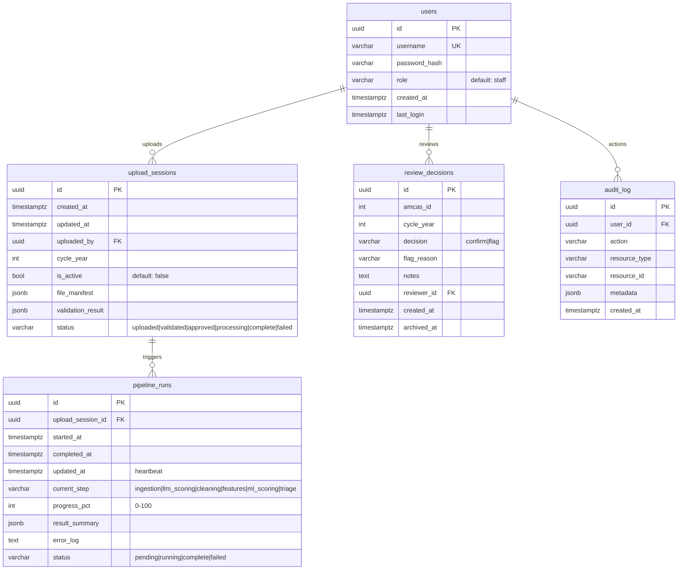

# feat: AMCAS Ingestion UI & Backend

## Enhancement Summary

**Deepened on:** 2026-02-13 (Round 1: 14 agents; Round 2: 4 deep-dive agents; Round 3: 4 ML/data specialists; Round 4: LLM scoring architecture research)
**Research agents used:** 26 total
- **Round 1:** Python reviewer, TypeScript reviewer, Security sentinel, Performance oracle, Architecture strategist, Data integrity guardian, Code simplicity reviewer, Deployment verification, Frontend races reviewer, Pattern recognition specialist, Backend best-practices researcher, Frontend best-practices researcher, Framework docs researcher, Frontend design skill
- **Round 2 deep-dives:** Security hardening (16 findings + remediation roadmap), Azure deployment (11 infrastructure files created), Frontend UX (complete component architecture for 4 pages), Pipeline performance (7 optimizations with benchmarks)
- **Round 3 ML/data deep-dives:** ML model serving & versioning (5 production recommendations), Data validation specification (7 validation categories + fuzzy column matching), Feature engineering analysis (11 ranked improvements + rubric economics), ML best practices research (6 production patterns with code)
- **Round 4 LLM scoring architecture:** GPT-4.1 API capabilities research, LLM-as-judge best practices (30+ papers), OpenAI Batch API deep-dive, Existing rubric scorer analysis

### Critical Issues Found

1. **Ephemeral filesystem in Azure Container Apps** -- `data/` directory is baked into Docker images and lost on restart. Must use Azure Files shared volume for model PKLs and pipeline output. (Architecture, Deployment)
2. **Alembic on startup races with multiple replicas** -- deploy.sh sets max-replicas=3. Run migrations as a one-shot `az containerapp job`, never in app startup. (Deployment, Data Integrity, Python)
3. **Approve endpoint race condition (TOCTOU)** -- concurrent clicks can create duplicate pipeline runs. Use `SELECT ... FOR UPDATE` or a unique partial index. (Data Integrity)
4. **No secret management** -- current deploy.sh passes zero secrets. Use Azure Key Vault + secret references. (Deployment, Security)
5. **DataStore reload only hits one replica** -- HTTP POST from Celery worker to API hits one instance. Use Redis pub/sub or pin to 1 replica during ingestion. (Architecture, Deployment)
6. **7 CRITICAL security findings** -- xlsx macro/formula injection, no rate limiting on login, no encryption at rest config, JWT lacks revocation, Redis unauthed. (Security)
7. **CORS hardcoded to localhost** -- will break in production. Read origins from env var. (Deployment)

### Key Improvements

1. **Phase sequencing fix** -- Move Azurite/Blob Storage setup to Phase 1 (needed by Phase 3, currently in Phase 6)
2. **Polling architecture** -- Use recursive `setTimeout` (not `setInterval`) with `AbortController` and visibility API
3. **Double-click prevention** -- Use `useRef` guards (not `useState`) for approve/retry/upload buttons
4. **Performance** -- Switch openpyxl to calamine for 7-8x xlsx parsing speedup; vectorize `derive_experience_binary_flags()`
5. **Naming consistency** -- Rename `pipeline_status.py` to `pipeline.py`, `error_translation.py` to `error_service.py`
6. **Model separation** -- Place SQLAlchemy ORM models in `api/db/models.py`, not `api/models/db.py` (which mixes ORM with Pydantic)
7. **Remove `register_year()`** -- Pass `cycle_year` as parameter instead of mutating global config

### Simplification Opportunity (Flagged by Simplicity Reviewer)

The simplicity reviewer argues Celery + Redis is unnecessary for 1-2 runs/cycle and proposes using FastAPI `BackgroundTasks` instead, reducing from 5 Docker services to 4 and eliminating Redis entirely. **Trade-off:** BackgroundTasks don't survive server restarts, have no built-in retries, and can't track progress via a result backend. For a FERPA-regulated system processing 17K applicants, Celery's durability is worth the added complexity. **Decision: Keep Celery**, but acknowledge this as a valid alternative for simpler deployments.

---

## Overview

Build a web-based interface for non-technical admissions office staff to upload AMCAS applicant data (multiple Excel files per cycle), preview and validate the parsed data, approve, and trigger the AI triage pipeline -- all without touching code or command-line tools.

This extends the existing FastAPI backend with PostgreSQL for app state, Celery + Redis for async pipeline execution, JWT auth, and Azure Blob Storage for file durability. The existing ML pipeline modules are wrapped by a new orchestrator that scores new applicants against pre-trained models.

**Key architectural decisions:**
1. New cycle uploads **score against the existing trained model** (not retrain). The model is trained on historical data (2022+2023, tested on 2024) and is retrained separately via `python -m pipeline`.
2. The ingestion pipeline runs: **LLM scoring (GPT-4.1-mini Batch API, ~24h)** -> clean -> features -> ML predict -> tier assignment.
3. LLM structured scoring is **mandatory** -- without it, the model is R²=0.04 (unusable). The ~24h Batch API turnaround is acceptable for 1-2 runs/cycle. The LLM reads each full application and scores 10 uncorrelated dimensions (1-10 scale) via holistic single-pass with chain-of-thought reasoning.

## Problem Statement

Today, processing a new AMCAS cycle requires a developer to:
1. Manually place Excel files in `data/raw/{year}/` with exact filenames
2. Run `python -m pipeline` from the command line
3. Restart the API to reload data into the DataStore
4. Hope nothing went wrong

This blocks admissions staff from operating independently and introduces human error at every step. The system processes ~17,000 applicants/year, runs 1-2 times per cycle, and must comply with FERPA audit requirements.

## Proposed Solution

A multi-step upload wizard in the existing Next.js frontend, backed by new FastAPI endpoints and a Celery-based pipeline orchestrator.

```
[Login] -> [Upload Files] -> [Preview & Validate] -> [Approve & Run] -> [Monitor Progress] -> [Review Queue]
                                                                              |
                                                                    [If Failed] -> [Error + Retry/Re-upload]
```

## Technical Approach

### Architecture

```
┌─────────────────────────────────────────────────────┐
│  Next.js Frontend (existing + new pages)            │
│  /login, /ingest, /ingest/[id]/preview, /status     │
└─────────────┬───────────────────────────────────────┘
              │ HTTP (JWT cookie)
┌─────────────▼───────────────────────────────────────┐
│  FastAPI Backend (existing + new routers)            │
│  /api/auth, /api/ingest, /api/pipeline              │
│  ┌──────────────┐  ┌───────────┐  ┌──────────────┐ │
│  │ Auth Service  │  │ Upload    │  │ Pipeline     │ │
│  │ (JWT+bcrypt)  │  │ Service   │  │ Orchestrator │ │
│  └──────────────┘  └───────────┘  └──────┬───────┘ │
└────────┬────────────────┬────────────────┼──────────┘
         │                │                │
    ┌────▼────┐    ┌──────▼──────┐   ┌────▼────┐
    │PostgreSQL│    │Azure Blob   │   │ Redis   │
    │(app state│    │Storage      │   │(Celery  │
    │ + audit) │    │(xlsx files) │   │ broker) │
    └─────────┘    └─────────────┘   └────┬────┘
                                          │
                                    ┌─────▼─────┐
                                    │Celery      │
                                    │Worker      │
                                    │(score      │
                                    │ pipeline)  │
                                    └────────────┘
```

### Implementation Phases

#### Phase 1: Foundation (Database, Auth, Infrastructure)

Set up PostgreSQL, Alembic migrations, JWT auth, and Docker Compose for local development. This unblocks all subsequent phases.

**Tasks:**

- [ ] Add Python dependencies to `api/requirements.txt`
  - `sqlalchemy>=2.0`, `alembic`, `psycopg2-binary`, `pyjwt`, `bcrypt`, `celery[redis]`, `azure-storage-blob`
- [ ] Create SQLAlchemy models in `api/models/db.py`
  - `User`, `UploadSession`, `PipelineRun`, `AuditLog` (see schema below)
- [ ] Set up Alembic in `api/alembic/`
  - `alembic init api/alembic`
  - Configure `alembic.ini` to read `DATABASE_URL` from env
  - Create initial migration with all 4 tables
- [ ] Create database session factory in `api/db.py`
  - `SessionLocal` with `get_db()` dependency for FastAPI
- [ ] Build auth service in `api/services/auth_service.py`
  - `hash_password(plain: str) -> str` using bcrypt
  - `verify_password(plain: str, hashed: str) -> bool`
  - `create_access_token(user_id: UUID, username: str) -> str` (8-hour expiry)
  - `decode_access_token(token: str) -> dict` (raises on expired/invalid)
- [ ] Build auth router in `api/routers/auth.py`
  - `POST /api/auth/login` -- validate credentials, set JWT in httpOnly cookie (`SameSite=Strict`)
  - `POST /api/auth/logout` -- clear cookie
  - `GET /api/auth/me` -- return current user info (for frontend session check)
- [ ] Create auth middleware/dependency in `api/dependencies.py`
  - `get_current_user(request: Request, db: Session) -> User` -- extract JWT from cookie, validate, return user
  - Apply to all routes except `/api/auth/login`, `/api/health`
- [ ] Create seed script `api/scripts/seed_users.py`
  - CLI script: `python -m api.scripts.seed_users --username admin --password <pass>`
  - Creates user in PostgreSQL with hashed password
- [ ] Create audit logging service in `api/services/audit_service.py`
  - `log_action(db, user_id, action, resource_type, resource_id, metadata)` -- writes to `audit_log` table
  - Actions: `login`, `logout`, `upload`, `preview`, `approve`, `retry`, `pipeline_complete`, `pipeline_failed`
- [ ] Update `infra/docker-compose.yml`
  - Add `postgres` service (port 5432, `POSTGRES_DB=rmc_every`)
  - Add `redis` service (port 6379)
  - Add `celery-worker` service (same image as API, runs `celery -A api.celery_app worker`)
  - Update `api` service with `DATABASE_URL`, `REDIS_URL` env vars
- [ ] Update `api/main.py`
  - Register auth router
  - Add CSRF protection: require `X-Requested-With: XMLHttpRequest` header on all POST/PUT/DELETE
  - Run Alembic migrations on startup (or document manual step)
- [ ] Build login page at `frontend/app/login/page.tsx`
  - Username/password form, POST to `/api/auth/login`
  - Redirect to `/ingest` on success
  - Show error on invalid credentials
- [ ] Add auth check to `frontend/lib/api.ts`
  - `fetchJSON` wrapper should handle 401 responses by redirecting to `/login`
  - Add `credentials: "include"` to all fetch calls (for cookie-based auth)
  - Add `X-Requested-With: XMLHttpRequest` header to all requests (CSRF protection)

**Files created/modified:**

| File | Action |
|------|--------|
| `api/requirements.txt` | Modify -- add new dependencies |
| `api/models/db.py` | Create -- SQLAlchemy models |
| `api/db.py` | Create -- database session factory |
| `api/alembic/` | Create -- Alembic migration directory |
| `api/alembic.ini` | Create -- Alembic config |
| `api/services/auth_service.py` | Create |
| `api/services/audit_service.py` | Create |
| `api/routers/auth.py` | Create |
| `api/dependencies.py` | Create -- auth dependency |
| `api/scripts/seed_users.py` | Create |
| `api/main.py` | Modify -- register auth router, add middleware |
| `api/celery_app.py` | Create -- Celery application setup |
| `infra/docker-compose.yml` | Modify -- add postgres, redis, celery-worker |
| `frontend/app/login/page.tsx` | Create |
| `frontend/lib/api.ts` | Modify -- add auth handling, credentials, CSRF header |

**Success criteria:**
- [ ] `docker compose up` starts all 5 services (postgres, redis, api, celery, frontend) + azurite
- [ ] `python -m api.scripts.seed_users --username admin --password test` creates a user
- [ ] `POST /api/auth/login` with valid credentials returns JWT in httpOnly cookie
- [ ] `GET /api/auth/me` returns user info when authenticated
- [ ] All existing endpoints (applicants, review, fairness) still work with auth applied
- [ ] Login page redirects to `/ingest` on success

##### Phase 1 Research Insights

**Critical corrections (from Deployment, Data Integrity, Architecture reviewers):**

- **Do NOT run Alembic on startup.** With max-replicas=3, multiple containers race to run the same migration. Run migrations as a one-shot `az containerapp job` (see Deployment section) or via `docker compose exec api alembic upgrade head` locally.
- **Move Azurite to Phase 1.** Blob Storage is needed by Phase 3 (upload service). Add `azurite` service to docker-compose.yml now, not in Phase 6. Configuration: `azurite --blobHost 0.0.0.0 --blobPort 10000`.
- **Add existing routers to auth scope.** Phase 1 adds auth middleware but doesn't list modifications to `applicants.py`, `review.py`, `fairness.py`, `stats.py`, `triage.py`. Either add `Depends(get_current_user)` to each, or implement auth as FastAPI middleware in `main.py` that excludes `/api/auth/login` and `/api/health`.
- **Replace `psycopg2-binary` with `psycopg2`** for production. The `-binary` package bundles its own libpq which can cause subtle issues in containerized environments.

**Security (from Security Sentinel):**

- **Rate-limit login endpoint** -- 5 attempts per minute per IP, 20 per hour. Use an in-memory counter or Redis-backed limiter.
- **Add account lockout** -- Lock after 10 failed attempts, auto-unlock after 30 minutes.
- **JWT needs `jti` claim** for individual token revocation. Store revoked JTIs in Redis with TTL matching token expiry.
- **Double-submit cookie pattern for CSRF** -- In addition to `X-Requested-With`, set a non-httpOnly `csrf_token` cookie that JS reads and sends as `X-CSRF-Token` header. Server verifies they match.
- **Seed script must not log/print passwords.** Use `getpass.getpass()` for interactive input or accept from env var only.

**Best practices (from Backend Research):**

- **Use `pydantic-settings`** for configuration: `class Settings(BaseSettings)` with `env_file=".env"`. All secrets from env vars, never hardcoded.
- **SQLAlchemy naming conventions on Base.metadata** -- Define `naming_convention` dict so Alembic generates deterministic constraint names (critical for reliable downgrades):
  ```python
  naming_convention = {
      "ix": "ix_%(column_0_label)s",
      "uq": "uq_%(table_name)s_%(column_0_name)s",
      "ck": "ck_%(table_name)s_%(constraint_name)s",
      "fk": "fk_%(table_name)s_%(column_0_name)s_%(referred_table_name)s",
      "pk": "pk_%(table_name)s",
  }
  ```
- **Session factory:** Use `expire_on_commit=False` if using async sessions (prevents `MissingGreenlet` errors). For sync sessions with Celery workers, create a separate `SessionLocal` per task, never share across tasks.
- **Alembic file template:** Use `%%(year)d_%%(month).2d_%%(day).2d_%%(rev)s_%%(slug)s` for date-sorted migration files.
- **Docker Compose health checks:** Add `pg_isready`, `redis-cli ping`, and `curl /api/health` health checks with `depends_on: condition: service_healthy`.

**Pattern consistency (from Pattern Recognition):**

- **Separate ORM from Pydantic models.** Place SQLAlchemy models in `api/db/models.py` (alongside `api/db/session.py`) instead of `api/models/db.py`. The existing `api/models/` directory contains exclusively Pydantic response models.
- **Document the two-service-pattern convention** in CLAUDE.md: DataStore-based services work with in-memory data; Session-based services work with PostgreSQL. Both coexist in `api/services/`.
- **`credentials: "include"` on fetchJSON** changes behavior of ALL existing API calls. The current CORS config (`allow_credentials=True`, `allow_headers=["*"]`) already supports this, but verify the `X-Requested-With` header is in `allow_headers`.

#### Phase 2: Pipeline Refactoring (Score-Only Path + Path Parameterization)

Refactor the existing pipeline to support scoring against a pre-trained model with arbitrary file paths. This is the critical prerequisite for the upload flow.

**Tasks:**

- [ ] Refactor `pipeline/data_ingestion.py` to accept file paths
  - Add `data_dir: Path | None = None` parameter to `_read_xlsx()`, `load_applicants()`, `load_experiences()`, etc.
  - Default to `DATA_DIR` (current behavior) when `data_dir` is None
  - Allow override for files downloaded from Blob Storage
  - Add `file_map_override: dict | None = None` parameter for custom filenames
- [ ] Add file-type detection utility in `pipeline/file_detection.py`
  - `detect_file_type(filepath: Path) -> str | None` -- reads first row of xlsx, matches column signatures
  - Column signatures:
    - Applicants: contains `Amcas_ID` (or variant) + `Application_Review_Score`
    - Experiences: contains `Amcas_ID` + (`Exp_Type` or `Experience_Type`) + `Hours`
    - Personal Statement: contains `Amcas_ID` + text column > 500 chars avg
    - GPA Trend: contains `Amcas_ID` + GPA-related columns
    - Languages: contains `Amcas_ID` + `Language`
    - Parents: contains `Amcas_ID` + education-related columns
    - Secondary: contains `Amcas_ID` + multiple text columns
  - `detect_all_files(filepaths: list[Path]) -> dict[str, Path]` -- maps logical type to path
  - Return unrecognized files separately for user review
- [ ] Create `pipeline/score_pipeline.py` -- score-only pipeline path
  - `score_new_cycle(data_dir: Path, cycle_year: int, model_pkl: str = "results_D_Struct+Rubric.pkl", file_map: dict | None = None, progress_callback: Callable | None = None, rubric_scores_path: Path | None = None) -> dict`
  - Steps:
    1. **Ingest** (10%): call refactored `build_unified_dataset(years=[cycle_year], data_dir=data_dir, file_map=file_map)`
    2. **LLM Scoring** (15%): submit to OpenAI Batch API (GPT-4.1-mini, 10 dimensions, holistic single-pass). Poll for completion (~24h). Save to `data/cache/rubric_scores.json`. _Note: this step is async -- the orchestrator submits the batch, then the Celery task polls periodically until results are ready._
    3. **Clean** (40%): call `clean_dataset(df)`
    4. **Features** (60%): call `extract_structured_features()`, `engineer_composite_features()`, `extract_binary_flags()`, load rubric scores from cache, apply calibration layer
    5. **ML Score** (80%): load model from `MODELS_DIR / model_pkl`, run `model.predict()` and `model.predict_proba()`
    6. **Triage** (100%): assign tiers using `SCORE_BUCKET_THRESHOLDS`, save `master_{year}.csv` to `PROCESSED_DIR`
  - `progress_callback(step: str, pct: int)` -- called after each step for status updates
  - Returns: `{"applicant_count": int, "tier_distribution": dict, "output_path": str, "llm_scoring_cost_usd": float}`
- [ ] Add `cycle_year` to `pipeline/config.py`
  - Add new year to `YEAR_FOLDERS` dynamically (don't hardcode every year)
  - `register_year(year: int, folder: str)` function
- [ ] Write unit tests for file detection
  - Test with real column headers from existing xlsx files
  - Test with renamed files
  - Test with wrong content (Experiences file passed as Applicants)

**Files created/modified:**

| File | Action |
|------|--------|
| `pipeline/data_ingestion.py` | Modify -- add path/file_map parameters |
| `pipeline/file_detection.py` | Create |
| `pipeline/score_pipeline.py` | Create |
| `pipeline/config.py` | Modify -- dynamic year registration |
| `tests/test_file_detection.py` | Create |
| `tests/test_score_pipeline.py` | Create |

**Success criteria:**
- [ ] `score_new_cycle(data_dir=Path("data/raw"), cycle_year=2024, model_pkl="results_A_Structured.pkl")` produces the same tier assignments as the current pipeline for 2024 data
- [ ] File detection correctly identifies all 7 file types from existing data
- [ ] Pipeline accepts arbitrary file paths (not just `DATA_DIR`)
- [ ] Progress callback is called after each step with correct percentages

##### Phase 2 Research Insights

**Critical corrections (from Architecture, Pattern Recognition):**

- **Remove `register_year()` from config.py.** Introducing a mutation function contradicts the "config is constant" convention (all values are uppercase, immutable at import time). Instead, pass `cycle_year` as an explicit parameter to `score_new_cycle()` and `build_unified_dataset()`. The pipeline should not modify global state.
- **`prediction_service.py` hardcodes `test_mask = df_valid[year_col] == 2024`** -- This must be parameterized for the score-only path to work with arbitrary years.
- **Handle missing target column** in the score-only path. New cycle data won't have `Application_Review_Score` (that's what the model predicts). The score pipeline must handle this column being absent during feature engineering.

**Performance (from Performance Oracle):**

- **Switch openpyxl to calamine** (`python-calamine` package) for 7-8x xlsx parsing speedup. openpyxl is the slowest Python xlsx parser. For read-only workloads (which this is), calamine (Rust-based) dramatically outperforms it. If calamine isn't available, `openpyxl` with `read_only=True` and `data_only=True` gives ~2x improvement.
- **Vectorize `derive_experience_binary_flags()`** -- Current implementation is `O(n*m*k)` with nested loops. Use `pandas.DataFrame.pivot_table` + boolean aggregation for 10-15x speedup.
- **Parallel Blob downloads** -- Download all 4-7 files from Azure Blob Storage concurrently using `asyncio.gather()` or `concurrent.futures.ThreadPoolExecutor`. Sequential downloads add unnecessary latency.
- **Defer SHAP computation** -- SHAP values are expensive (minutes for 17K applicants). Make it optional: compute basic predictions first (fast), then run SHAP as a separate step or on-demand per applicant.

**File detection (from Code Simplicity Reviewer):**

- **Simplify file detection.** Instead of complex column-signature matching, use a simpler approach: exact filename matching first (AMCAS exports have consistent names), then fall back to column-header heuristics, with manual override as the final fallback. Three layers, simplest first.

#### Phase 3: Upload & Validation Backend

Build the file upload, validation, and session management endpoints.

**Tasks:**

- [ ] Create upload service in `api/services/upload_service.py`
  - `create_session(db, user_id, cycle_year) -> UploadSession`
  - `upload_files(db, session_id, files: list[UploadFile]) -> UploadSession`
    - Validate: all files are .xlsx, individual file < 50MB, total < 200MB
    - Upload each file to Azure Blob Storage: `uploads/{session_id}/{original_filename}`
    - Store `file_manifest` JSONB with filename, size, blob_path, detected_type
    - Use `detect_all_files()` to auto-detect file types
    - Set session status to `uploaded`
  - `validate_session(db, session_id) -> ValidationResult`
    - Download files from Blob to temp dir
    - Check required files present (Applicants, Experiences, Personal Statement, GPA Trends)
    - Check required columns per file type
    - Cross-file AMCAS_ID join check
    - Applicants row count sanity check (> 100)
    - Return: errors (block approval), warnings (allow with acknowledgment), info (stats)
    - Set session status to `validated`
    - Log audit event
  - `get_preview(db, session_id) -> PreviewData`
    - Return: per-file stats (rows, columns, detected type), sample rows (first 10), aggregate stats, validation result
- [ ] Create Pydantic models in `api/models/ingest.py`
  - `UploadResponse(session_id, files_received, detected_types, status)`
  - `ValidationResult(errors: list[ValidationIssue], warnings: list[ValidationIssue], info: list[str])`
  - `ValidationIssue(severity, file_type, message, detail)`
  - `PreviewData(session_id, cycle_year, status, files: list[FilePreview], validation: ValidationResult, total_applicants, total_amcas_ids)`
  - `FilePreview(filename, detected_type, row_count, column_count, sample_rows: list[dict], columns: list[str])`
  - `SessionSummary(id, cycle_year, status, created_at, uploaded_by, applicant_count)`
- [ ] Create ingest router in `api/routers/ingest.py`
  - `POST /api/ingest/upload` -- accept multipart form (files + cycle_year field)
    - Create session, upload to Blob, auto-detect types, return `UploadResponse`
    - Run validation asynchronously (or inline if fast enough for < 20MB files)
  - `GET /api/ingest/sessions` -- list past sessions (most recent first)
  - `GET /api/ingest/{session_id}/preview` -- return preview + validation result
    - If validation not yet run, trigger it
  - `POST /api/ingest/{session_id}/approve` -- check no active pipeline run, enqueue Celery task
    - Fail with 409 if another pipeline run is active
    - Create `PipelineRun` record (status `pending`)
    - Enqueue Celery task
    - Set session status to `approved`
    - Log audit event
    - Return `PipelineRunResponse(run_id, status)`
  - `POST /api/ingest/{session_id}/retry` -- retry from failed session
    - Validate session is in `failed` status
    - Create new `PipelineRun` record
    - Enqueue Celery task
    - Log audit event
  - `PATCH /api/ingest/{session_id}/file-types` -- manual file type override
    - Accept `{filename: detected_type}` mapping
    - Update `file_manifest` JSONB
    - Re-run validation
- [ ] Create error translation layer in `api/services/error_translation.py`
  - Map common Python exceptions to user-friendly messages:
    - `KeyError('Amcas_ID')` -> "The Applicants file is missing the required 'AMCAS ID' column."
    - `openpyxl.InvalidFileException` -> "One of the uploaded files is corrupted or not a valid Excel file."
    - `MemoryError` -> "The uploaded files are too large to process. Please contact support."
    - `ValueError` in feature engineering -> "Some applicant records have unexpected data formats."
  - `translate_error(exc: Exception, step: str) -> str`

**Files created/modified:**

| File | Action |
|------|--------|
| `api/services/upload_service.py` | Create |
| `api/services/error_translation.py` | Create |
| `api/models/ingest.py` | Create |
| `api/routers/ingest.py` | Create |
| `api/main.py` | Modify -- register ingest router |

**Success criteria:**
- [ ] Upload 7 xlsx files via `POST /api/ingest/upload`, get back session with detected file types
- [ ] Validation catches: missing required file, wrong columns, low row count
- [ ] Preview endpoint returns per-file stats and sample rows
- [ ] Approve endpoint rejects when a pipeline run is already active (409)
- [ ] Retry endpoint creates a new pipeline run for a failed session
- [ ] File type override allows manual correction of auto-detection

##### Phase 3 Research Insights

**Critical corrections (from Data Integrity, Security):**

- **Approve endpoint race condition (TOCTOU).** Two concurrent clicks can both pass the "no active run" check and create duplicate pipeline runs. Fix with `SELECT ... FOR UPDATE` on the session row, or use a unique partial index: `CREATE UNIQUE INDEX uq_active_pipeline_run ON pipeline_runs(upload_session_id) WHERE status IN ('pending', 'running')`.
- **xlsx macro/formula injection.** Uploaded xlsx files may contain macros or formulae that reference external resources. Use openpyxl/calamine in `data_only=True` mode. Reject files with VBA macros (`file.vba_archive is not None`). Reject files > 50MB (zip bomb protection).
- **Blob upload cleanup on failure.** If the upload endpoint fails after uploading some files to Blob Storage, the orphaned blobs remain. Implement cleanup: on error, delete all blobs uploaded in this session. Or accept orphans and clean them up via a lifecycle policy.
- **Preview endpoint exposes PII.** Sample rows from AMCAS data contain student personal information. Ensure the preview endpoint redacts or limits PII fields. At minimum, don't return full personal statements in preview (truncate to 100 chars).

**Best practices (from Backend Research):**

- **Stream uploads in 1MB chunks** using `aiofiles`, don't load entire file into memory:
  ```python
  CHUNK_SIZE = 1024 * 1024
  async with aiofiles.open(temp_path, "wb") as out:
      while chunk := await file.read(CHUNK_SIZE):
          await out.write(chunk)
  ```
- **Validate three layers:** content-type header, magic bytes (first 8 bytes of xlsx = PK zip signature `50 4B 03 04`), and cumulative size during streaming.
- **Generate UUID filenames** in Blob Storage to prevent path traversal: `uploads/{session_id}/{uuid4()}.xlsx`, store original filename in `file_manifest` JSONB.
- **Use `DefaultAzureCredential`** (Managed Identity in production, connection string locally) instead of hardcoding connection strings. For local dev, Azurite accepts any connection string.

**Naming consistency (from Pattern Recognition):**

- Rename `error_translation.py` to `error_service.py` to match the `<domain>_service.py` convention.

#### Phase 4: Pipeline Orchestrator (Celery Task)

Build the Celery task that wraps the score pipeline and reports progress.

**Tasks:**

- [ ] Create Celery app in `api/celery_app.py`
  - Configure broker URL from `REDIS_URL` env var
  - Configure result backend (use Redis)
  - Set task timeout: 30 minutes
  - Set task retry policy: no auto-retry (user must explicitly retry)
- [ ] Create pipeline orchestrator task in `api/tasks/run_pipeline.py`
  - `@celery_app.task(bind=True, name="run_score_pipeline")`
  - `def run_score_pipeline(self, session_id: str, run_id: str) -> dict`
  - Steps:
    1. Update `pipeline_runs.status` to `running`, set `started_at`
    2. Download files from Blob Storage to temp directory
    3. Map detected file types to temp file paths
    4. Call `score_new_cycle(data_dir=temp_dir, cycle_year=session.cycle_year, progress_callback=update_progress)`
    5. `update_progress(step, pct)` -- writes to `pipeline_runs.current_step` and `progress_pct` via direct DB update
    6. On success: set status `complete`, store `result_summary`, trigger DataStore reload
    7. On failure: set status `failed`, store translated error in `error_log`
    8. Clean up temp directory
    9. Log audit event
  - Heartbeat: update `pipeline_runs.updated_at` every 30 seconds during processing
- [ ] Create DataStore reload mechanism
  - Add `POST /api/internal/reload` endpoint (only callable from localhost/Celery worker)
  - Calls `request.app.state.store.load_all()` to refresh in-memory data
  - The Celery task calls this endpoint after pipeline completion via HTTP
  - Alternative: use a shared signal/flag that the main process checks periodically
- [ ] Create pipeline status router in `api/routers/pipeline_status.py`
  - `GET /api/pipeline/runs` -- list all runs (most recent first), include session info
  - `GET /api/pipeline/runs/{run_id}` -- detailed status (polled by frontend)
    - Return: status, current_step, progress_pct, started_at, elapsed_time, error_log, result_summary
- [ ] Add stuck-run detection
  - Celery beat task (runs every 5 minutes): check for `pipeline_runs` where status is `running` and `updated_at` is older than 10 minutes
  - Mark as `failed` with error: "Pipeline timed out. The worker may have crashed. Please retry."
  - Log audit event

**Files created/modified:**

| File | Action |
|------|--------|
| `api/celery_app.py` | Create |
| `api/tasks/__init__.py` | Create |
| `api/tasks/run_pipeline.py` | Create |
| `api/routers/pipeline_status.py` | Create |
| `api/main.py` | Modify -- register pipeline_status router, add /internal/reload |

**Success criteria:**
- [ ] Celery worker picks up task and runs score pipeline
- [ ] Progress updates visible at `GET /api/pipeline/runs/{run_id}` during execution
- [ ] On completion, DataStore reloads and `/api/review/queue` returns new cycle data
- [ ] On failure, error_log contains user-friendly message
- [ ] Stuck run detection marks timed-out runs as failed after 10 minutes

##### Phase 4 Research Insights

**Critical corrections (from Architecture, Deployment, Python reviewers):**

- **Replace HTTP reload with Redis pub/sub.** The `POST /api/internal/reload` endpoint only hits one API replica. In Azure Container Apps with multiple replicas, other instances serve stale data. Use Redis pub/sub: after pipeline completion, publish a `reload` message. Each API instance subscribes and reloads its DataStore. Alternative (simpler): pin API to 1 replica during ingestion.
- **Celery tasks need their own `SessionLocal`.** Never share a database session between the main process and Celery workers. Workers fork from the main process; reusing connections causes `InterfaceError`. Create a fresh session at the start of each task, close it in `finally`.
- **DataStore reload must be atomic.** The current `load_all()` mutates instance attributes one by one. During reload, a request could read partially-loaded data. Use an atomic swap: build a new DataStore instance, then replace `app.state.store` with the new instance in a single assignment.
- **Set `visibility_timeout` higher than the longest task.** Redis redelivers tasks after `visibility_timeout` (default 1 hour). For a 30-minute pipeline, this is fine, but explicitly set `visibility_timeout: 43200` (12 hours) to be safe.
- **Set `task_acks_late=True` and `task_reject_on_worker_lost=True`** so tasks are re-delivered if a worker crashes mid-execution.
- **Set `broker_connection_retry_on_startup=True`** explicitly to avoid Celery 6.0 deprecation warning.

**Rename (from Pattern Recognition):**

- Rename `pipeline_status.py` to `pipeline.py` -- existing routers use single-word names (`applicants.py`, `review.py`, `triage.py`).

**Monitoring (from Deployment Verification):**

- Deploy Flower (Celery monitoring) as a sidecar or separate Container App. At minimum, log all task state transitions.
- Add a deep health check endpoint `/api/health/ready` that checks PostgreSQL, Redis, and DataStore loaded status. Use for readiness probe; keep `/api/health` as liveness probe.

#### Phase 5: Frontend Upload Wizard

Build the upload, preview, and status pages in the Next.js frontend.

**Tasks:**

- [ ] Add TypeScript types to `frontend/lib/types.ts`
  - `UploadSession`, `PipelineRun`, `ValidationResult`, `ValidationIssue`, `FilePreview`, `PreviewData`
- [ ] Add API functions to `frontend/lib/api.ts`
  - `uploadFiles(files: File[], cycleYear: number): Promise<UploadResponse>`
    - Use `FormData` for multipart upload
  - `getSessions(): Promise<SessionSummary[]>`
  - `getPreview(sessionId: string): Promise<PreviewData>`
  - `approveSession(sessionId: string): Promise<PipelineRunResponse>`
  - `retrySession(sessionId: string): Promise<PipelineRunResponse>`
  - `getPipelineRun(runId: string): Promise<PipelineRun>`
  - `updateFileTypes(sessionId: string, mapping: Record<string, string>): Promise<void>`
- [ ] Build upload page at `frontend/app/ingest/page.tsx`
  - Cycle year selector (dropdown, defaults to current year)
  - Drag-and-drop zone for xlsx files (accept multiple)
  - Per-file display: filename, size, detected type (with manual override dropdown)
  - Required files checklist: green check for detected, red X for missing
  - Upload progress bar per file
  - "Upload & Validate" button (disabled until all required files detected)
  - Session history list below the upload zone (past sessions with status badges)
  - Banner: "Pipeline running for cycle {year}" when a run is active (disable uploads)
- [ ] Build preview page at `frontend/app/ingest/[sessionId]/preview/page.tsx`
  - Per-file summary card: filename, detected type, row count, column count
  - Expandable sample rows table (first 10 rows per file)
  - Validation results panel:
    - Errors (red) -- block approval, explain why
    - Warnings (amber) -- allow approval, explain risk
    - Info (gray) -- stats (total applicants, AMCAS_ID coverage)
  - "Approve & Run Pipeline" button (disabled if errors exist, enabled with warning acknowledgment)
  - "Re-upload" button to start a new session
- [ ] Build status page at `frontend/app/ingest/[sessionId]/status/page.tsx`
  - Pipeline step progress: 6 steps with progress bar (ingestion, LLM scoring, cleaning, features, ML scoring, triage)
  - LLM scoring step shows "Waiting for batch results..." with estimated completion time
  - Current step highlighted, completed steps checked
  - Elapsed time display
  - Poll `GET /api/pipeline/runs/{run_id}` every 3 seconds (every 60 seconds during LLM scoring phase)
  - On focus: re-fetch immediately (handle browser tab backgrounding)
  - On completion: show success banner with tier distribution summary, "Go to Review Queue" button
  - On failure: show error message (user-friendly), "Retry" button, "Re-upload" button
  - Guidance text: retry = same data (for transient errors), re-upload = fix data issues
- [ ] Update sidebar in `frontend/components/ui/sidebar.tsx`
  - Add "Ingest" nav item with Upload icon before "Pipeline"
- [ ] Add auth middleware to Next.js
  - Check for valid session on every page load (call `GET /api/auth/me`)
  - Redirect to `/login` if not authenticated
  - Simple approach: check in layout.tsx or use a client-side auth context

**Files created/modified:**

| File | Action |
|------|--------|
| `frontend/lib/types.ts` | Modify -- add ingestion types |
| `frontend/lib/api.ts` | Modify -- add ingestion API functions |
| `frontend/app/ingest/page.tsx` | Create |
| `frontend/app/ingest/[sessionId]/preview/page.tsx` | Create |
| `frontend/app/ingest/[sessionId]/status/page.tsx` | Create |
| `frontend/app/login/page.tsx` | Create (from Phase 1) |
| `frontend/components/ui/sidebar.tsx` | Modify -- add Ingest nav item |

**Success criteria:**
- [ ] Staff can drag-and-drop xlsx files, see detected types, override if needed
- [ ] Preview page shows validation errors/warnings clearly
- [ ] Approve button disabled when errors exist
- [ ] Status page shows real-time progress with step indicators
- [ ] Failure page shows user-friendly error with clear retry vs re-upload guidance
- [ ] Session history shows past uploads with status

##### Phase 5 Research Insights

**Critical -- Polling architecture (from Frontend Races Reviewer):**

The status page polling is the most race-prone area. **Do NOT use `setInterval`:**
- Chrome throttles `setInterval` to once/minute in backgrounded tabs
- On tab refocus, both the visibility handler and the interval fire, causing two concurrent requests
- Responses arrive out of order, making the progress bar jump backwards

**Use recursive `setTimeout` with `AbortController`:**
```typescript
useEffect(() => {
  const controller = new AbortController();
  let nextTimeout: ReturnType<typeof setTimeout> | null = null;

  const poll = async () => {
    if (controller.signal.aborted) return;
    try {
      const run = await fetchJSON<PipelineRun>(
        `/api/pipeline/runs/${runId}`,
        { signal: controller.signal }
      );
      if (controller.signal.aborted) return;
      setRun(run);
      if (run.status === "running" || run.status === "pending") {
        nextTimeout = setTimeout(poll, 3000);
      }
    } catch (e) {
      if (e instanceof DOMException && e.name === "AbortError") return;
      if (controller.signal.aborted) return;
      setError(String(e));
    }
  };

  poll();

  const onVisibilityChange = () => {
    if (document.visibilityState === "visible" && !controller.signal.aborted) {
      if (nextTimeout !== null) clearTimeout(nextTimeout);
      poll();
    }
  };
  document.addEventListener("visibilitychange", onVisibilityChange);

  return () => {
    controller.abort();
    if (nextTimeout !== null) clearTimeout(nextTimeout);
    document.removeEventListener("visibilitychange", onVisibilityChange);
  };
}, [runId]);
```

**Critical -- Double-click prevention (from Frontend Races Reviewer):**

`useState` is NOT synchronous enough to prevent double-clicks. Between two rapid clicks in the same render cycle, the closure value hasn't updated. **Use `useRef`:**
```typescript
const approving = useRef(false);
const handleApprove = () => {
  if (approving.current) return;
  approving.current = true;
  setApprovalState("approving");
  approveSession(sessionId)
    .then(() => router.push(`/ingest/${sessionId}/status`))
    .catch(() => { approving.current = false; setApprovalState("error"); });
};
```
Apply this pattern to Approve, Retry, and Upload buttons.

**Critical -- fetchJSON changes (from TypeScript Reviewer, Pattern Recognition):**

- Add `credentials: "include"` for JWT cookies
- Pass `signal` through to underlying `fetch` for AbortController support
- Detect `FormData` body and skip `Content-Type: application/json` header (otherwise multipart uploads break)
- Handle 401 inline in polling loops (show "session expired" message, not redirect)
```typescript
async function fetchJSON<T>(path: string, init?: RequestInit): Promise<T> {
  const isFormData = init?.body instanceof FormData;
  const res = await fetch(`${API_BASE}${path}`, {
    ...init,
    credentials: "include",
    headers: {
      ...(isFormData ? {} : { "Content-Type": "application/json" }),
      "X-Requested-With": "XMLHttpRequest",
      ...init?.headers,
    },
  });
  if (!res.ok) throw new Error(`API error: ${res.status} ${res.statusText}`);
  return res.json() as Promise<T>;
}
```

**Upload page (from Frontend Races Reviewer):**

- Warn on navigation during upload with `beforeunload` event (only while uploading)
- Abort in-flight uploads on unmount via `AbortController`
- Use `XMLHttpRequest` (not `fetch`) for per-file upload progress bars (`fetch` doesn't support upload progress)
- Do NOT set `Content-Type` header on `FormData` requests (browser sets multipart boundary automatically)

**Auth (from Frontend Best Practices Research):**

- **Next.js 16 renamed `middleware.ts` to `proxy.ts`** -- If targeting Next.js 16, use `proxy.ts` for route protection. File lives in project root, same API.
- Store `returnTo` URL on 401 redirect: `router.push(\`/login?returnTo=${encodeURIComponent(pathname)}\`)`
- Do NOT redirect to login from the polling loop. Show inline "session expired" message instead -- the pipeline may have completed while the token expired.
- Consider TanStack Query for polling (built-in `refetchInterval` with function form, auto-pauses in background tabs, built-in retries with exponential backoff).

**Wizard state (from Frontend Races Reviewer):**

- Each wizard page should **verify session status on mount** and redirect if the session has moved to an unexpected state (another user approved it, or it timed out).
- Preview page must handle "validation not yet complete" gracefully -- show a loading state and poll/retry, not a broken page.

**Accessibility (from Frontend Best Practices Research):**

- Use `role="progressbar"` with `aria-valuenow`, `aria-valuemin`, `aria-valuemax` on progress indicators
- Use `role="alert"` on error messages for screen reader announcements
- Error messages for non-technical users: lead with "Something went wrong" not HTTP status codes
- Upload zone: support keyboard interaction (Enter/Space to open file picker), not just drag-and-drop

#### Phase 6: Integration & Polish

Wire everything together, add cycle-year filtering to the review queue, and polish the UX.

**Tasks:**

- [ ] Add cycle_year filter to existing review queue
  - Modify `GET /api/review/queue` in `api/routers/review.py` to accept `?cycle_year=` param
  - Modify `GET /api/applicants` in `api/routers/applicants.py` to accept `?cycle_year=` param
  - Default to most recent cycle year
  - Add cycle year selector dropdown to review page and applicants page
- [ ] Migrate review decisions from JSON to PostgreSQL
  - Create `review_decisions` table: `(id, amcas_id, cycle_year, decision, flag_reason, notes, reviewer_id, created_at)`
  - Migrate existing `review_decisions.json` data
  - Update `review_service.py` to read/write from PostgreSQL
  - Log audit events for all review decisions
- [ ] Handle re-upload of same cycle year
  - When uploading for an existing cycle year with completed reviews:
    - Show warning: "Cycle {year} has {n} existing reviews. Re-uploading will archive these reviews."
    - Require explicit confirmation
    - Archive old reviews (add `archived_at` column, set timestamp)
- [ ] Add Azure Blob Storage configuration
  - Environment variables: `AZURE_STORAGE_CONNECTION_STRING`, `AZURE_STORAGE_CONTAINER`
  - For local development: use Azurite (Azure Storage emulator) in Docker Compose
  - Add `azurite` service to `docker-compose.yml`
- [ ] Update `infra/deploy.sh` for new services
  - Add Azure Database for PostgreSQL provisioning
  - Add Azure Cache for Redis provisioning
  - Add Azure Blob Storage container creation
  - Update Container App with new env vars
- [ ] End-to-end testing
  - Upload 2024 data through the UI
  - Verify tier assignments match current pipeline output
  - Verify review queue shows new data
  - Test failure and retry flow
  - Test with missing required file
  - Test with wrong file content

**Files created/modified:**

| File | Action |
|------|--------|
| `api/routers/review.py` | Modify -- add cycle_year filter |
| `api/routers/applicants.py` | Modify -- add cycle_year filter |
| `api/services/review_service.py` | Modify -- PostgreSQL persistence |
| `api/models/db.py` | Modify -- add ReviewDecision model |
| `infra/docker-compose.yml` | Modify -- add azurite service |
| `infra/deploy.sh` | Modify -- Azure resource provisioning |

**Success criteria:**
- [ ] Review queue filters by cycle year
- [ ] Review decisions persist in PostgreSQL with audit trail
- [ ] Re-upload of same cycle year archives old reviews with warning
- [ ] Full upload-to-review flow works end-to-end
- [ ] Azure deployment script provisions all required resources

##### Phase 6 Research Insights

**Critical corrections (from Deployment Verification):**

- **Ephemeral filesystem in Azure Container Apps.** The current Dockerfile bakes `data/` into the image. Pipeline output written at runtime vanishes on container restart. Provision an **Azure Files share** mounted as `/app/data` on both API and Celery worker containers. Upload existing model PKLs and processed CSVs to this share before first deploy.
- **Tag Docker images with git SHA or semver**, not just `:latest`. This makes rollback possible (`az containerapp update` to previous tag).
- **Split deploy.sh into `provision.sh` (run once) and `deploy.sh` (run per release).** The current script conflates resource provisioning with image deployment.
- **CORS must read origins from env var.** Current config hardcodes `localhost:3000`. In production, set `ALLOWED_ORIGINS` to the frontend Container App URL.
- **Fix CORS for production** in `api/main.py`:
  ```python
  import os
  allowed_origins = os.environ.get("ALLOWED_ORIGINS", "http://localhost:3000").split(",")
  ```

**Deployment checklist (from Deployment Verification Agent):**

A comprehensive Go/No-Go deployment checklist has been generated covering:
- Secret management via Azure Key Vault (DATABASE_URL, REDIS_URL, JWT_SECRET, AZURE_STORAGE_CONNECTION_STRING)
- Azure resource provisioning (PostgreSQL, Redis, Blob Storage, Azure Files)
- Baseline data capture (backup review_decisions.json, record row counts)
- Staging validation (all 5 services, auth flow, upload end-to-end, failure/retry)
- 9-step production deploy sequence (provision -> secrets -> images -> worker -> migrate -> seed -> API -> frontend -> data migration)
- Post-deploy verification (health checks, auth, data integrity, CORS)
- Rollback plan with step-by-step commands
- Monitoring setup (container restarts, PostgreSQL connections, Redis memory, 5xx rate, audit log gaps)

See: `docs/brainstorms/fastapi-stack-best-practices-2025-2026.md` for full deployment checklist and reference code.

**Data migration (from Data Integrity Guardian):**

- **review_decisions needs a unique partial index:** `CREATE UNIQUE INDEX uq_review_decisions_active ON review_decisions(amcas_id, cycle_year) WHERE archived_at IS NULL` -- prevents duplicate active decisions for the same applicant.
- **Specify ON DELETE behavior** for all foreign keys. Recommended: `ON DELETE SET NULL` for `reviewer_id`, `ON DELETE CASCADE` for `upload_session_id` on pipeline_runs.
- **Soft-delete users** (add `deleted_at` column) rather than hard-delete, since audit_log references `user_id`.
- **JSON-to-PostgreSQL migration** for review decisions: backup JSON first, verify row counts match after migration, keep JSON read path as fallback during transition (Phases 1-5 use JSON, Phase 6 completes migration).

**FERPA compliance (from Deployment Verification):**

- Enable encryption at rest on Azure Database for PostgreSQL (default on Flexible Server)
- Enable TLS for all connections (PostgreSQL SSL mode, Redis TLS)
- Set audit log retention to minimum 6 years
- Enable Azure Diagnostic Logging for all services -> Log Analytics workspace
- Set Azure Backup retention to 35 days on PostgreSQL

## Database Schema (ERD)



### Database Research Insights

**From Data Integrity Guardian and Python Reviewer:**

- **Status fields must be PostgreSQL ENUMs or CHECK constraints**, not unbounded varchar. Prevents typos and invalid states:
  ```sql
  CREATE TYPE session_status AS ENUM ('uploaded', 'validated', 'approved', 'processing', 'complete', 'failed');
  CREATE TYPE run_status AS ENUM ('pending', 'running', 'complete', 'failed');
  ```
- **Add NOT NULL constraints** on: `upload_sessions.cycle_year`, `upload_sessions.status`, `pipeline_runs.status`, `audit_log.action`, `audit_log.created_at`.
- **Add CHECK constraints:** `pipeline_runs.progress_pct BETWEEN 0 AND 100`.
- **Index strategy:**
  - `upload_sessions`: index on `(cycle_year, status)`, partial index on `is_active WHERE is_active = true`
  - `pipeline_runs`: index on `(upload_session_id, status)`, partial unique index on `(upload_session_id) WHERE status IN ('pending', 'running')`
  - `review_decisions`: partial unique index on `(amcas_id, cycle_year) WHERE archived_at IS NULL`
  - `audit_log`: index on `(user_id, created_at)`, index on `(resource_type, resource_id)`
  - JSONB GIN indexes on `file_manifest` and `validation_result` if querying these fields
- **UUID type note for TypeScript:** UUIDs are `string` in TypeScript (not `number` like existing `amcas_id`). Document this as an intentional deviation in `frontend/lib/types.ts`.

## State Machines

### Upload Session Status

```
uploaded -> validated -> approved -> processing -> complete
                |            |          |
                v            v          v
              failed      failed     failed
                |            |          |
                v            v          v
           (re-upload)  (re-upload)  (retry -> new pipeline_run -> processing)
```

### Pipeline Run Status

```
pending -> running -> complete
              |
              v
           failed (manual retry creates NEW run, does not update this one)
              |
              v
           (timeout detection: running > 10min with no heartbeat -> failed)
```

## Validation Severity Model

| Condition | Severity | Blocks Approval? |
|-----------|----------|:----------------:|
| Missing required file (Applicants, Experiences, Personal Statement, GPA Trends) | ERROR | Yes |
| Missing AMCAS_ID column in any file | ERROR | Yes |
| Zero AMCAS_ID overlap between Applicants and other files | ERROR | Yes |
| Applicants file < 100 rows | ERROR | Yes |
| File is not .xlsx format | ERROR | Yes |
| Partial AMCAS_ID overlap (some IDs in Experiences not in Applicants) | WARNING | No |
| Unexpected extra columns in a file | WARNING | No |
| Optional file missing (Secondary, Languages, Parents) | INFO | No |
| Applicant count, column count summaries | INFO | No |

## File-Type Detection Strategy

Auto-detect by column headers with manual override on the upload page.

**Column signatures** (checked in order of specificity):

| File Type | Required Columns | Distinguishing Columns |
|-----------|-----------------|----------------------|
| Applicants | `Amcas_ID` | `Application_Review_Score` or `Service_Rating` |
| Experiences | `Amcas_ID` | `Exp_Type` or `Experience_Type` or `Hours` |
| GPA Trend | `Amcas_ID` | `GPA` or `Cumulative_GPA` or `Science_GPA` |
| Personal Statement | `Amcas_ID` | Single long text column (avg > 500 chars) |
| Secondary | `Amcas_ID` | Multiple text columns, no `Exp_Type` or `GPA` |
| Languages | `Amcas_ID` | `Language` or `Language_Name` |
| Parents | `Amcas_ID` | `Parent` or `Education_Level` or `Occupation` |

If auto-detection fails, show "Unknown type" with a dropdown for manual selection.

## Alternative Approaches Considered

See brainstorm: `docs/brainstorms/2026-02-13-amcas-ingestion-ui-brainstorm.md`

- **Microservice architecture** -- rejected (over-engineered for 1-2 runs/cycle)
- **Next.js full-stack + serverless** -- rejected (splits runtimes, abandons FastAPI)
- **Retrain on each upload** -- rejected (slow, unnecessary; score against pre-trained model)
- **SSE/WebSockets for progress** -- rejected (polling is simpler, acceptable for 1-2 runs/cycle)

## Acceptance Criteria

### Functional Requirements

- [ ] Admissions staff can log in with seeded credentials
- [ ] Staff can upload 4-7 xlsx files via drag-and-drop
- [ ] System auto-detects file types with manual override option
- [ ] Validation catches missing files, wrong columns, format issues
- [ ] Staff can preview parsed data before approving
- [ ] Pipeline runs asynchronously via Celery with progress updates
- [ ] Staff sees real-time progress (polling every 3 seconds)
- [ ] On completion, review queue shows new cycle's applicants
- [ ] On failure, staff sees user-friendly error with retry/re-upload options
- [ ] One cycle processes at a time (concurrent runs blocked)
- [ ] Session history shows past uploads

### Non-Functional Requirements

- [ ] End-to-end time from upload to triage results under 26 hours for 17K applicants (~24h LLM batch scoring + ~15min ML pipeline)
- [ ] File upload supports up to 50MB per file, 200MB total
- [ ] FERPA audit trail logs all user actions (login, upload, approve, review)
- [ ] JWT auth with SameSite=Strict cookie + CSRF header protection
- [ ] Stuck pipeline detection marks timed-out runs as failed within 10 minutes
- [ ] 3-year file retention policy on Azure Blob Storage

### Quality Gates

- [ ] Unit tests for file detection, validation, error translation
- [ ] Integration test for full upload-to-review flow
- [ ] All existing tests still pass (`bun test`)
- [ ] TypeScript strict mode -- no `any` types in new code
- [ ] Alembic migration is reversible (downgrade works)

## Dependencies & Prerequisites

| Dependency | Required By | Status |
|-----------|-------------|--------|
| PostgreSQL database | Phase 1 | New |
| Redis server | Phase 1 | New |
| Azure Blob Storage (or Azurite for local) | Phase 3 | New |
| Existing trained model PKL | Phase 2 | Exists (`data/models/results_A_Structured.pkl`) |
| Existing pipeline modules | Phase 2 | Exists (needs refactoring) |
| Existing Next.js frontend | Phase 5 | Exists |
| Existing FastAPI backend | All phases | Exists |

## Risk Analysis & Mitigation

| Risk | Impact | Likelihood | Mitigation |
|------|--------|------------|------------|
| Pipeline refactoring breaks existing pipeline | High | Medium | Run existing pipeline before/after refactoring, compare outputs |
| DataStore reload causes brief API inconsistency | Medium | High | Reload is fast (seconds); add loading state in UI |
| Celery worker crashes mid-pipeline | High | Low | Heartbeat + timeout detection; manual retry |
| AMCAS changes column names between years | Medium | Medium | File detection uses fuzzy matching; manual override available |
| Large file uploads time out | Medium | Low | 50MB limit per file; chunked upload if needed later |
| Review decisions lost on re-upload | High | Medium | Archive (not delete) old decisions; require explicit confirmation |

## Future Considerations

- **Role-based access** -- Admin can upload/configure, Reviewer can only review. Uses existing `users.role` column.
- **Batch upload via SFTP** -- For institutions that automate AMCAS export delivery.
- **Model retraining trigger** -- Separate UI for data analysts to retrain models with new historical data.
- **Email notifications** -- Notify staff when pipeline completes or fails.
- **Multi-cycle support** -- Process multiple cycles simultaneously (requires removing single-cycle constraint).

## Second Round Deep-Dive Findings

### Deep-Dive A: Security Hardening (16 Findings)

The security sentinel performed a comprehensive audit producing 16 findings with a prioritized remediation roadmap. Full details including production-ready code snippets are in the agent output.

**Pre-deployment blockers (before any real student data):**

1. **Add authentication to every endpoint** -- All current routers expose FERPA-protected data without any auth. Apply `Depends(get_current_user)` before any deployment.
2. **CSRF protection (signed double-submit)** -- Set a non-httpOnly `csrf_token` cookie via HMAC of session ID + server secret. JS reads it, sends as `X-CSRF-Token` header. Server verifies the HMAC.
3. **FERPA audit logging** -- Log every access to student data with user, action, timestamp, resource ID, IP address. 6-year minimum retention.
4. **xlsx sanitization** -- Validate magic bytes (`50 4B 03 04`), reject files with VBA macros (`file.vba_archive is not None`), enforce `data_only=True` and `read_only=True`, compute SHA-256 for integrity tracking, limit to 50MB per file.
5. **Strict input validation** -- Add `Literal` constraints on `decision` field, regex patterns on `config` parameter, `max_length` on all string fields. Prevent path traversal in uploaded filenames.

**Production hardening:**

6. **Rate limiting** -- SlowAPI with Redis backend: 5 login attempts/min/IP, 20/hour/IP, 100 API calls/min/user. Account lockout after 10 failed attempts, auto-unlock after 30 min.
7. **JWT token revocation** -- Store revoked JTIs in Redis with TTL matching token expiry. Add `jti` claim to all tokens. Short-lived access tokens (15 min) + 8-hour refresh tokens.
8. **Security headers middleware** -- `X-Content-Type-Options: nosniff`, `X-Frame-Options: DENY`, `Strict-Transport-Security`, `Content-Security-Policy`, `Referrer-Policy`, `Permissions-Policy`.
9. **Docker non-root user** -- Create `appuser`, `chown` app files, `USER appuser`. Remove `data/` from image (mount as volume).
10. **Pickle safety** -- Add HMAC-SHA256 integrity verification for model PKL files. Training pipeline signs, score pipeline verifies.
11. **CORS tightening** -- Explicit `allow_methods` and `allow_headers` lists instead of wildcards. Read origins from `ALLOWED_ORIGINS` env var.
12. **Error response sanitization** -- Custom exception handlers to never leak stack traces in production. Return generic "Internal server error" for 500s.
13. **Request ID middleware** -- `X-Request-Id` header for FERPA audit trail correlation.
14. **Dependency pinning** -- Pin all requirements to exact versions. Run `pip-audit` in CI.
15. **Azure network isolation** -- VNet with subnets for app service, database, Redis. Key Vault with `Deny` default ACL. Storage account with `shared_access_key_enabled = false`.
16. **Data volume read-only mounts** -- Separate read-only mounts for models/processed data; writable only for decisions.

**Settings consolidation:** All secrets via `pydantic-settings.BaseSettings` with Key Vault references in production, `.env` in development. Separate Redis databases for broker (0), rate limiting (2), token revocation (3).

### Deep-Dive B: Azure Deployment Infrastructure (11 Files Created)

The DevOps agent created a complete production-ready infrastructure suite. All files are in `infra/` and `.github/workflows/`.

**Files created:**

| File | Lines | Purpose |
|------|-------|---------|
| `infra/provision.sh` | ~350 | One-time Azure infrastructure provisioning (PostgreSQL 16, Redis, Storage, Key Vault, Container Apps Environment) |
| `infra/deploy.sh` | ~300 | Application deployment (build images, migrate, deploy all 3 container apps) -- *replaces existing stub* |
| `infra/rollback.sh` | ~200 | Safe rollback with ACR image verification, confirmation prompts, health checks |
| `infra/docker-compose.yml` | ~200 | Complete local dev: postgres, redis, azurite, api, celery, frontend with health checks |
| `infra/.env.example` | ~80 | Environment template with Azurite connection strings |
| `infra/Makefile` | ~300 | 30+ convenience commands (deploy, dev-up, logs, secrets, scale) |
| `infra/README.md` | ~500 | Full documentation: architecture, deployment, scaling, monitoring, costs (~$70-110/month) |
| `infra/QUICKSTART.md` | ~300 | Fast-track deployment guide (25 min to production) |
| `infra/CICD-SETUP.md` | ~400 | GitHub Actions setup with service principal, secrets, workflow details |
| `infra/FILES.md` | ~350 | File reference with dependency diagram |
| `.github/workflows/azure-deploy.yml` | ~250 | CI/CD: test (pytest+coverage) -> security (Trivy) -> deploy -> notify (Slack/Discord) |

**Key infrastructure decisions:**

- **PostgreSQL 16 Flexible Server** (Standard_B1ms, 32GB, SSL enforced, 35-day backup retention)
- **Azure Cache for Redis** (Basic C0, TLS 1.2+)
- **Storage Account** with blob container (`amcas-uploads`), file share (`rmc-data`, 100GB), lifecycle policy (cool after 30 days, delete after 3 years)
- **Key Vault** for all secrets (DATABASE_URL, REDIS_URL, JWT_SECRET, AZURE_STORAGE_CONNECTION_STRING)
- **Container Apps** with managed identity, Key Vault secret references, Azure Files volume mounts
- **Alembic migrations** run as one-shot Container Apps Job (not on startup)
- **Docker images tagged with git SHA** (not `:latest`) for reliable rollback

**Cost estimate:** ~$70-110/month for full production stack.

### Deep-Dive C: Frontend Component Architecture

The frontend agent produced a comprehensive component architecture spec with complete TypeScript code for all 4 pages. Saved at `docs/AMCAS_INGESTION_WIZARD_ARCHITECTURE.md`.

**Shared infrastructure (5 modules):**

1. **`AuthContext`** (`frontend/lib/auth-context.tsx`) -- Global auth provider with `GET /api/auth/me` check, `returnTo` URL, automatic `/login` redirect.
2. **`usePolling`** (`frontend/lib/hooks/use-polling.ts`) -- Recursive `setTimeout` + `AbortController` + Page Visibility API. Pauses in background tabs, resumes on focus.
3. **`useMutationGuard`** (`frontend/lib/hooks/use-mutation-guard.ts`) -- `useRef`-based double-click prevention (not `useState` -- closures stale in same render cycle).
4. **`useAbortController`** (`frontend/lib/hooks/use-abort-controller.ts`) -- Auto-cleanup of in-flight requests on unmount.
5. **TypeScript types** (`frontend/lib/types-ingestion.ts`) -- `IngestionSession`, `AmcasFileType`, `ValidationResults`, `PipelineStatus`, `PipelineStepStatus`, etc.

**Page components:**

| Page | Components | Key patterns |
|------|-----------|-------------|
| `/login` | `LoginForm` | Error state, loading spinner, `returnTo` redirect |
| `/ingest` | `CycleYearSelector`, `UploadZone`, `FileList`, `RequiredFilesChecklist`, `SessionHistoryTable`, `PipelineRunningBanner` | Drag-drop with `ondragover`/`ondrop`, XHR for upload progress (not `fetch`), `beforeunload` warning during upload |
| `/ingest/[id]/preview` | `FileSummaryGrid`, `ValidationPanel`, `ApproveButton` | Errors (red, block approval) vs warnings (amber, require ack) vs info (gray), `useMutationGuard` on approve |
| `/ingest/[id]/status` | `PipelineStatusDisplay`, `StepStatusItem` | 5-step progress with icons (spinner/check/X), elapsed time counter, inline session-expired message (not redirect), retry vs re-upload guidance |

**Accessibility:** `role="progressbar"` with ARIA attributes, `role="alert"` on errors, keyboard-accessible upload zone (Enter/Space opens file picker), semantic HTML landmarks, color + text/icons.

**Styling:** Uses existing Rush brand colors (wash-gray, raw-umber, sage, rose, growth-green, purple, cerulean-blue, ivory), Calibre font, Card/Badge components.

### Deep-Dive D: Pipeline Performance Analysis

The performance oracle analyzed the existing pipeline code and data file sizes, producing 7 prioritized optimizations with benchmarks.

**Data profile:** 3 years x 7 file types, total ~22.5MB xlsx. Largest files: experiences (~4.1MB), applicants (~3.7MB). Score-only path processes 1 year (~7.5MB, 7 files).

**P0 optimizations (highest impact, lowest effort):**

1. **Switch openpyxl to calamine** (`python-calamine`) -- Rust-based xlsx parser, 7-8x speedup for read-only workloads. Fallback: openpyxl with `read_only=True, data_only=True` for ~2x improvement. Saves **30-75 seconds** on full pipeline. Implementation: add `engine="calamine"` to `pd.read_excel()` calls with try/except fallback.

2. **Vectorize `derive_experience_binary_flags()`** -- Current: O(A*T*E) with Python-level loops over 17K applicants. Replacement: pandas `str.contains()` + `groupby().any()`. Saves **10-40 seconds** (15-45s down to 1-3s). The key insight: `str.contains()` on a Series runs at C/Cython level, not Python string matching.

**P1 optimizations:**

3. **Defer SHAP in score-only path** -- SHAP on 17K applicants takes **6-16 minutes** (2 models x TreeExplainer). Make `compute_shap=False` the default. Compute per-applicant SHAP on-demand (<100ms per applicant via TreeExplainer on single row). Batch SHAP runs as a background Celery task after the main pipeline completes.

4. **Parallel file reads** -- `ThreadPoolExecutor(max_workers=4)` for `load_applicants`, `load_experiences`, etc. xlsx decompression releases the GIL. Saves **10-20 seconds**.

**P2/P3 optimizations:**

5. **Header-only file detection** -- `pd.read_excel(path, nrows=0)` reads only column headers (<100ms vs 1-12s for full read).
6. **DataFrame memory optimization** -- `category` dtype for low-cardinality strings, `float32` for GPAs/hours, `int16` for binary flags. Saves ~30MB peak memory.
7. **Remove unnecessary `.copy()`** in `build_unified_dataset` line 304 -- `applicants` DataFrame is never used after the merge. Saves ~50MB.

**Score-only pipeline time budget:**

| Metric | Before optimization | After optimization |
|--------|--------------------|--------------------|
| Total time (17K applicants) | ~35-95 seconds | ~10-25 seconds |
| Bottleneck | xlsx parsing (40-50%) | Balanced across parsing, scoring, merges |
| SHAP (if deferred) | 6-16 min saved | Computed on-demand per-applicant |

**Benchmarking recommendation:** Add `StepTimer` context manager to log `PERF [step_name]: X.XXs` for each pipeline stage, enabling before/after measurement for each optimization.

---

## Third Round: ML/Data Pipeline Deep-Dive

Four specialist agents analyzed the existing 10-module ML pipeline (~2,500 lines) across `pipeline/config.py`, `pipeline/data_ingestion.py`, `pipeline/two_stage_pipeline.py`, `api/services/prediction_service.py`, and related files. Key findings organized by domain:

### ML-1: Score-Only Pipeline Architecture

**Critical finding:** The production pipeline runs **score-only** (predict with pre-trained model), not retrain. Current `prediction_service.py` has a hardcoded `test_mask = df_valid[year_col] == 2024` that must be parameterized for new cycles.

**Recommended `score_new_cycle()` function:**
- Accept `cycle_year` and `model_config` parameters
- Detect rubric availability automatically: if rubric coverage >= 50%, use Plan B (R²=0.72); otherwise fall back to Plan A (R²=0.04) with loud warnings
- Add `confidence_flag` column: "high" if rubric present, "low" otherwise
- Log tier distribution + score percentiles to `pipeline_runs.result_summary` (JSONB)

**Model selection logic:**

| Rubric coverage | Model | Expected R² | Confidence |
|----------------|-------|-------------|------------|
| >= 50% | Plan B (struct + rubric) | 0.72 | HIGH |
| < 50% | Plan A (struct only) | 0.04 | LOW -- warn staff |

**Action:** Plan A is nearly unusable (R²=0.04). The pipeline MUST include LLM structured scoring (see ML-2) as a mandatory pre-step before ML prediction.

**Note on GPA/MCAT:** These features are intentionally excluded. Applicants reaching this system have already passed the institution's GPA/MCAT minimum thresholds. The remaining pool has compressed variance on academic metrics, so GPA/MCAT do not meaningfully discriminate within this pre-screened population. The discriminating signal comes from qualitative dimensions captured by LLM structured scoring.

### ML-2: LLM Structured Scoring Architecture

**Context:** Applicants reaching this system have already passed GPA/MCAT minimum thresholds. The remaining pool has compressed variance on academic metrics, so the discriminating signal comes from qualitative dimensions -- exactly what LLM scoring captures. Without LLM rubric features, the model is R²=0.04 (unusable). With them, R²=0.72.

**Architecture: GPT-4.1-mini + OpenAI Batch API + Holistic Single-Pass**

| Decision | Choice | Rationale |
|----------|--------|-----------|
| **Model** | GPT-4.1-mini | Best cost/quality ratio for structured scoring. Matches gpt-4.1 on constrained tasks, 5x cheaper. Nano too weak for nuanced essay evaluation. |
| **Delivery** | OpenAI Batch API (50% discount) | Submit all 17K as one batch, results in ~24h. 100% JSON schema compliance via structured outputs. |
| **Read strategy** | Holistic single-pass | LLM reads full application (PS + experiences + secondary) and produces one set of scores. Matches human reviewer process. Cheaper than section-by-section (1 call vs 3). |
| **Reasoning** | Chain-of-thought before scoring | Research shows significant accuracy improvement. LLM writes brief analysis per dimension, then scores. Adds ~300 tokens/applicant (~$3 total). Provides audit trail. |
| **Scale** | 1-10 per dimension | Better discrimination than current 1-5 for 17K applicants. LLMs produce more consistent scores at this granularity. |
| **Reproducibility** | temperature=0, seed=42, structured outputs | ~95% reproducible (not 100% due to GPU variance). Structured JSON schema guarantees valid output. Accept ±1 point tolerance. |

**Cost (17K applicants via Batch API):**

| Scenario | Cost | Turnaround |
|----------|------|-----------|
| Single pass (recommended) | **~$18** | ~24 hours |
| Triple pass (variance reduction for borderline) | ~$54 | ~24 hours |
| + 5% QA audit with gpt-4.1 full | +$4 | same batch |

**10 Scoring Dimensions** (collapsed from current 30 to eliminate multicollinearity):

Current system has r>0.95 between 8 personal quality dimensions and 61% bimodal zeros. New architecture scores 10 uncorrelated dimensions, each 1-10 with chain-of-thought evidence:

1. **Writing & Communication Quality** -- clarity, organization, grammar (separated from content to flag SES/coaching effects)
2. **Mission Alignment** -- commitment to underserved communities, Rush's urban mission
3. **Adversity & Resilience** -- sustained effort through setbacks, what they DID not just felt
4. **Clinical Experience Quality** -- depth of patient interaction, progression of responsibility (not just hours)
5. **Research Engagement** -- meaningful contribution, independent thinking, output quality
6. **Leadership & Initiative** -- genuine responsibility, progression, measurable impact
7. **Service Orientation** -- sustained community engagement, relationship building vs resume padding
8. **Motivation Depth** -- genuine, tested understanding of daily medical realities
9. **Personal Growth & Self-Awareness** -- emotional intelligence, honest reflection
10. **Holistic Fit** -- overall candidacy strength for Rush specifically

**Calibration layer** (from [LLM-Rubric, ACL 2024](https://aclanthology.org/2024.acl-long.745.pdf)):

Raw LLM scores don't perfectly correlate with human judgments, but a small calibration network trained on historical data achieves RMS error < 0.5. Since we have 1,300 applicants with actual reviewer scores:

1. Score all 17K with GPT-4.1-mini (raw LLM scores)
2. Train calibration layer on 1,300 historical examples (raw LLM → actual reviewer score)
3. Apply calibration to 17K raw scores
4. Use calibrated scores as XGBoost features

**Feature redundancy fix:** Drop `Total_Volunteer_Hours` and `Clinical_Total_Hours` (near-perfect linear combinations of other features, confirmed r>0.95).

**Implementation:**

- Refactor `pipeline/rubric_scorer.py` to use OpenAI Batch API with structured outputs
- Replace 30-dimension prompts with single holistic prompt per applicant
- Store `OPENAI_API_KEY` in Azure Key Vault
- Version prompts in `pipeline/rubric_prompts.py` (version string + prompt text + model ID)
- Add `rubric_scoring` as first pipeline step in orchestrator

**LLM scoring pipeline step (new):**

```
Approve → LLM Scoring (~24h) → Data Cleaning (30%) → Features (50%) → ML Scoring (80%) → Triage (100%)
```

**Important:** The ~24h Batch API turnaround means the pipeline is no longer a 15-minute synchronous flow. The LLM scoring step should be a separate Celery task that submits the batch and polls for completion, then triggers the remaining pipeline steps. The frontend status page shows "LLM Scoring (waiting for batch results)" during this phase.

**Structured output schema:**

```json
{
  "applicant_id": "string",
  "dimensions": [
    {
      "dimension": "writing_communication_quality",
      "reasoning": "Brief analysis of this dimension...",
      "score": 7
    }
  ],
  "overall_impression": "2-sentence holistic summary"
}
```

**Batch API workflow:**

```python
# 1. Build JSONL (one line per applicant)
# 2. Upload file to OpenAI
# 3. Create batch job (gpt-4.1-mini, temp=0, seed=42, structured output schema)
# 4. Poll for completion (~24h)
# 5. Download results, parse structured JSON
# 6. Save to data/cache/rubric_scores.json (same location, new format)
# 7. Continue with data cleaning → features → ML scoring → triage
```

**References:**
- [LLM-Rubric: Calibrated Approach to NL Evaluation (ACL 2024)](https://aclanthology.org/2024.acl-long.745.pdf)
- [OpenAI Structured Outputs Guide](https://platform.openai.com/docs/guides/structured-outputs)
- [OpenAI Batch API Documentation](https://platform.openai.com/docs/guides/batch)
- [LLM-as-Judge Reliability (arXiv 2024)](https://arxiv.org/abs/2412.12509)
- [Applying LLMs and Chain-of-Thought for Automatic Scoring](https://www.sciencedirect.com/science/article/pii/S2666920X24000146)
- [Iterative Consensus Ensemble for Medical AI (2025)](https://www.sciencedirect.com/science/article/abs/pii/S0010482525010820)

### ML-3: Data Validation Specification

Full specification saved at `docs/brainstorms/data_validation_specification.md`. Key elements:

**Three-tier column matching:**
1. Exact match (after normalization: lowercase, spaces→underscores, strip parens)
2. Known aliases (e.g., `Disadvantanged_Ind` → `Disadvantaged_Ind` -- known 2024 typo)
3. Fuzzy match via `SequenceMatcher` (threshold 0.85)

**Data mode detection:**
- `TRAINING` (target coverage >= 95%): Historical data with `Application_Review_Score`
- `SCORING` (target coverage = 0%): New applicants, no scores yet
- `MIXED` (0% < coverage < 95%): ERROR -- inconsistent data

**Validation categories (Phase 1-3 implementation):**

| Phase | Checks | Severity |
|-------|--------|----------|
| 1 (Week 1) | ID column matching, row count min/max, cross-file consistency, critical columns >50% missing, numeric hard limits | ERROR (blocks pipeline) |
| 2 (Week 2) | Column count, outlier detection (IQR), missing value patterns, duplicates, file-specific validation | WARNING (require ack) |
| 3 (Week 3) | Distribution comparison (KS test + PSI), binary feature anomaly, schema evolution, rubric availability → model selection | INFO/WARNING |

**Edge case handlers:**
- Experience hours 10x higher (minutes vs hours): detect via `median > 10,000`, offer "Divide by 60" button
- New columns in scoring data: INFO only, columns ignored by model
- Binary feature always-zero-now-positive: WARNING, flag predictions as unreliable
- GPA scale detection: `max > 4.5` → WARNING (5.0 scale?)

### ML-4: Feature Engineering Improvements

Full analysis saved at `docs/feature_engineering_analysis.md`. **11 ranked improvements:**

**Tier 1 -- Immediate (this sprint):**

1. ~~**Extract GPA/MCAT from Academic Records**~~ -- **EXCLUDED BY DESIGN.** Applicants are pre-screened by GPA/MCAT minimums before reaching this system. Variance is compressed; these features don't discriminate within the pre-filtered pool.
2. **Drop 2 redundant linear combinations** -- `Total_Volunteer_Hours` (Med + Non-Med volunteer, r≈0.98), `Clinical_Total_Hours` (Shadowing + Employment, r≈0.91). No performance loss. 1 hour.
3. **Implement feature drift detection** -- KS tests on all numeric features vs training distribution. PSI > 0.2 = significant drift. Alert if >20% of features drift. 1-2 days.
4. **Save training statistics with model artifact** -- Means, stds, medians, distributions. Required for score-only normalization and drift detection. 2 hours.
5. **Refactor rubric scoring to GPT-4.1-mini** -- Replace 30-dimension 1-5 scale with 10-dimension 1-10 holistic scoring via OpenAI Batch API (see ML-2 for full architecture). This is the highest-impact change.

**Tier 2 -- Medium priority (this month):**

6. **NLP features for personal statements** -- 8 lightweight features (`word_count`, `sentence_count`, `lexical_diversity`, `flesch_readability`, `medical_keyword_density`, `service_keyword_density`, `sentiment_polarity`, `avg_sentence_length`). +0.05-0.10 R² as rubric fallback if LLM scoring unavailable. 1 day.
7. **Investigate binary flag redundancy** -- `has_research` likely r>0.95 with `Exp_Hour_Research > 0`. Keep `has_honors` and `has_leadership` (no hour equivalent). Drop 4-6 flags if confirmed. 2 hours.
8. **Re-evaluate GPA Trend** -- Currently dropped (>70% missing). Investigate raw data quality in `12. GPA Trend.xlsx`. "Upward trend" is a strong resilience signal. 4 hours.
9. **Train calibration layer** -- Small neural network mapping raw LLM scores → actual reviewer scores using 1,300 historical examples. RMS error < 0.5 per LLM-Rubric paper. Critical for aligning LLM output with institutional preferences.

**Feature count after improvements:** 46 → 44 (drop 2 redundant) - 30 old rubric + 10 new rubric dims + 1 rubric_scored_flag = **25 structured + 10 LLM rubric + 1 flag = ~36 features**

### ML-5: Model Versioning & Registry

**Current state:** Models stored as `.pkl`/`.joblib` with no metadata, validation, or drift detection.

**Recommended: `ModelRegistry` class** (`pipeline/model_registry.py`):
- JSON-based registry at `models/model_registry.json`
- Each entry tracks: `model_id`, `version_id` (timestamped), `model_hash` (SHA-256), `training_manifest` (train years, data hash, n_train, n_test, feature count), `metrics` (R², MAE, AUC), `feature_schema` (feature names + dtypes), `status` (active/deprecated/archived)
- `validate_model_for_inference()`: checks new data schema against expected features, reports missing/extra/type-mismatched features
- `get_production_model()`: retrieves latest active version

**Training manifest example:**
```json
{
  "train_years": [2022, 2023],
  "test_year": 2024,
  "train_data_hash": "sha256:abc123...",
  "n_train": 1303,
  "n_test": 634,
  "feature_count": 47
}
```

### ML-6: Tier Threshold Management

**Current state:** `SCORE_BUCKET_THRESHOLDS = [6.25, 12.5, 18.75]` are research placeholders.

**Recommended approach:**
1. **First production run:** Use existing thresholds, generate `threshold_recommendation_{year}.json` with score distribution + quantile-based recommendations
2. **After staff review 4,000 applicants:** Recalibrate using `calibrate_thresholds_from_feedback()` -- set tier 0/1 boundary at 90th percentile of rejects, tier 1/2 at 25th percentile of interviews
3. **Store as versioned config** (`ThresholdConfig` dataclass with `version`, `created_by`, `rationale`, `model_version`)
4. **Alert if year-over-year change > 3 points** on any threshold

**Default tier target sizes:** 70% auto-reject, 15% committee review, 10% strong, 5% priority interview.

### ML-7: Production ML Best Practices

From the best practices researcher (6 production patterns with code):

**Model serving:** Batch script (not real-time API) for 1-2x/year scoring. If interactive access needed, use FastAPI `lifespan` events to load model once at startup into `app.state`. XGBoost `predict()` is thread-safe; set `OMP_NUM_THREADS=1` per worker to avoid thread contention.

**Prediction auditing (FERPA requirement):**
- Append-only JSONL audit log with: `prediction_id`, `batch_run_id`, `timestamp`, `model_version`, `model_hash`, `applicant_id` (de-identified), `feature_values`, `raw_prediction`, `assigned_tier`, `threshold_config`, `shap_top_5`, `scored_by`
- Store separately from application database (tamper-evident)
- 6-year retention per FERPA

**Monitoring without ground truth:**
- `PredictionMonitor` class: KS test on prediction distribution, per-feature drift, outlier analysis, prediction spread analysis
- Evidently AI `DataDriftPreset` for HTML drift reports
- Post-scoring validation notebook checklist: histogram overlay, per-feature KS table, tier distribution check, outlier check, correlation stability

**Threshold management:**
- Static per cycle (compute once, validate against historical outcomes, get admissions sign-off, lock)
- `recalibration_report()`: KS test comparing current vs reference prediction distributions
- If distribution shifted significantly, present report to admissions team -- humans decide threshold adjustments

**XGBoost quantile regression:**
- Validate calibration: if alpha=0.25, ~25% of actual values should fall below predictions (tolerance ±5%)
- Consider conformal correction for guaranteed coverage
- Explain to non-technical staff as "floor estimate" / "conservative score" -- "the applicant is likely to score at least this high"

### ML-8: Production Deployment Checklist (ML-Specific)

**Immediate (next 2 weeks):**
- [ ] Parameterize `prediction_service.py` to accept `cycle_year` (remove hardcoded 2024)
- [ ] Refactor `pipeline/rubric_scorer.py` to GPT-4.1-mini + OpenAI Batch API with 10-dimension holistic scoring (see ML-2)
- [ ] Drop 2 redundant linear combination features (`Total_Volunteer_Hours`, `Clinical_Total_Hours`)
- [ ] Create `ModelRegistry` class and register existing models
- [ ] Save training statistics with model artifacts
- [ ] Add PSI drift monitoring to pipeline orchestrator
- [ ] Store `OPENAI_API_KEY` in Azure Key Vault

**Next sprint (4 weeks):**
- [ ] Integrate Batch API LLM scoring as pipeline pre-step (Celery task: submit batch → poll → continue)
- [ ] Train calibration layer on 1,300 historical examples (raw LLM scores → actual reviewer scores)
- [ ] Add `threshold_recommendation_{year}.json` generation after scoring
- [ ] Build NLP features for personal statement fallback (in case LLM scoring unavailable)
- [ ] Implement FERPA-compliant prediction audit logging (JSONL)
- [ ] Add post-scoring validation notebook (drift checks, distribution plots)
- [ ] Version prompts in `pipeline/rubric_prompts.py` (version string + prompt text + model ID)

**Before go-live:**
- [ ] Run full-scale test: submit 17K applicants to Batch API, verify structured outputs parse correctly
- [ ] Validate Batch API turnaround fits within operational timeline (~24h)
- [ ] Compare new 10-dimension scores against old 30-dimension scores on 1,300 historical applicants
- [ ] Train and validate calibration layer (RMS error target: < 0.5)
- [ ] Get admissions committee sign-off on tier thresholds
- [ ] Document model decision logic in staff-facing FAQ
- [ ] Set up Azure monitoring alerts for PSI >0.2
- [ ] Test fallback path if OpenAI Batch API is unavailable (NLP features as degraded mode)

---

## References & Research

### Internal References

- Brainstorm: `docs/brainstorms/2026-02-13-amcas-ingestion-ui-brainstorm.md`
- Pipeline orchestrator: `pipeline/run_pipeline.py`
- Data ingestion (refactor target): `pipeline/data_ingestion.py`
- Config (paths, features, file map): `pipeline/config.py`
- API main (router registration pattern): `api/main.py`
- DataStore (reload target): `api/services/data_service.py`
- Review service (migration target): `api/services/review_service.py`
- Docker Compose (extend): `infra/docker-compose.yml`
- Azure deploy (extend): `infra/deploy.sh`

### Existing Patterns to Follow

- Router pattern: `APIRouter(prefix="/api/<domain>", tags=["<domain>"])` -- see `api/routers/applicants.py`
- Service pattern: plain functions accepting `DataStore` or `Session` -- see `api/services/data_service.py`
- Pydantic models: v2 `BaseModel`, `X | None` syntax -- see `api/models/applicant.py`
- Frontend pages: `"use client"` + `useEffect`/`useState` -- see `frontend/app/applicants/page.tsx`
- TypeScript types: snake_case properties matching Python -- see `frontend/lib/types.ts`
- API client: `fetchJSON<T>(path, init)` wrapper -- see `frontend/lib/api.ts`

### External References (from Research Agents)

**FastAPI + Celery:**
- [FastAPI + Celery Production Guide 2025](https://medium.com/@dewasheesh.rana/celery-redis-fastapi-the-ultimate-2025-production-guide)
- [Celery Tasks Documentation](https://docs.celeryq.dev/en/stable/userguide/tasks.html)
- [SQLAlchemy Session Handling in Celery Tasks](https://celery.school/sqlalchemy-session-celery-tasks)

**SQLAlchemy 2.0 + Alembic:**
- [SQLAlchemy 2.0 Async I/O](https://docs.sqlalchemy.org/en/20/orm/extensions/asyncio.html)
- [Alembic Autogenerate](https://alembic.sqlalchemy.org/en/latest/autogenerate.html)
- [Patterns for SQLAlchemy 2.0 with FastAPI](https://chaoticengineer.hashnode.dev/fastapi-sqlalchemy)

**Security:**
- [Security Design with FastAPI: JWT, CSRF, Cookies](https://blog.greeden.me/en/2025/10/14/a-beginners-guide-to-serious-security-design-with-fastapi/)
- [FastAPI JWT httpOnly Cookie Tutorial](https://www.fastapitutorial.com/blog/fastapi-jwt-httponly-cookie/)
- [FastAPI CSRF Protection (StackHawk)](https://www.stackhawk.com/blog/csrf-protection-in-fastapi/)

**Azure:**
- [Azure Storage Blobs Python SDK](https://learn.microsoft.com/en-us/python/api/overview/azure/storage-blob-readme)
- [User Delegation SAS with Python](https://learn.microsoft.com/en-us/azure/storage/blobs/storage-blob-user-delegation-sas-create-python)
- [Azure Blob Retry Policy](https://learn.microsoft.com/en-us/azure/storage/blobs/storage-retry-policy-python)

**Frontend:**
- [Next.js 16 Blog Post](https://nextjs.org/blog/next-16) -- proxy.ts, React 19.2
- [Next.js Authentication Guide](https://nextjs.org/docs/app/guides/authentication)
- [TanStack Query useQuery Reference](https://tanstack.com/query/v5/docs/framework/react/reference/useQuery)
- [File Uploader Accessibility (Uploadcare)](https://uploadcare.com/blog/file-uploader-accessibility/)

### Research Documents Generated

- `docs/brainstorms/fastapi-stack-best-practices-2025-2026.md` -- Full code examples for FastAPI+Celery, JWT auth, SQLAlchemy 2.0, Azure Blob Storage, Alembic setup
- `docs/AMCAS_INGESTION_WIZARD_ARCHITECTURE.md` -- Complete frontend component architecture (types, hooks, 4 pages, API contracts, accessibility checklist)

### ML/Data Research Documents Generated (Round 3)

- `docs/brainstorms/data_validation_specification.md` -- Comprehensive validation framework: column fuzzy matching, row/column validation, numeric ranges, missing values, duplicates, cross-file consistency, schema evolution, drift detection, file-specific validation, edge cases, ValidationResult model
- `docs/brainstorms/validation_implementation_summary.md` -- Implementation summary with phased rollout, API integration, monitoring, success criteria
- `docs/feature_engineering_analysis.md` -- Deep feature analysis: importance ranking, redundancy analysis, missing GPA/MCAT, NLP features, rubric integration strategy, drift mitigation, score-only deployment spec, model artifact structure
- `docs/feature_engineering_recommendations_executive_summary.md` -- Executive summary: top 4 immediate actions, rubric economics, medium-priority enhancements, production checklist

### LLM Scoring Architecture References (Round 4)

**Model & API:**
- [OpenAI GPT-4.1 Announcement](https://openai.com/index/gpt-4-1/) -- GPT-4.1-mini pricing: $0.40/M input, $1.60/M output (50% off via Batch API)
- [OpenAI Structured Outputs Guide](https://platform.openai.com/docs/guides/structured-outputs) -- 100% JSON schema compliance
- [OpenAI Batch API Documentation](https://platform.openai.com/docs/guides/batch) -- 50% discount, 24h turnaround, 50K requests/batch

**LLM-as-Judge Research:**
- [LLM-Rubric: Calibrated Multi-Dimensional Evaluation (ACL 2024)](https://aclanthology.org/2024.acl-long.745.pdf) -- Calibration layer achieves RMS < 0.5
- [Can You Trust LLM Judgments? (arXiv 2024)](https://arxiv.org/abs/2412.12509) -- 60-70% agreement with humans in specialized domains
- [A Survey on LLM-as-a-Judge (arXiv 2024)](https://arxiv.org/abs/2411.15594) -- Comprehensive survey of evaluation methods
- [Iterative Consensus Ensemble for Medical AI (2025)](https://www.sciencedirect.com/science/article/abs/pii/S0010482525310820) -- 72% → 81% accuracy with multi-model consensus

**Scoring & Calibration:**
- [Applying LLMs and Chain-of-Thought for Automatic Scoring](https://www.sciencedirect.com/science/article/pii/S2666920X24000146) -- 13.44% improvement with CoT
- [Likert or Not: LLM Relevance Judgments on Fine-Grained Scales (arXiv 2025)](https://arxiv.org/html/2505.19334v1) -- Larger scales improve LLM evaluation
- [Grade Like a Human: Rethinking Automated Assessment (2024)](https://arxiv.org/pdf/2405.19694) -- Essay scoring with LLMs

**Bias & Reproducibility:**
- [Justice or Prejudice? Quantifying Biases in LLM-as-a-Judge](https://llm-judge-bias.github.io/) -- Position bias, verbosity bias mitigation
- [Non-Determinism of "Deterministic" LLM Settings (arXiv 2024)](https://arxiv.org/html/2408.04667v5) -- Temperature=0 yields ~95% reproducibility, not 100%
- [Am I More Pointwise or Pairwise? Position Bias (arXiv 2025)](https://arxiv.org/html/2602.02219) -- Rubric design to reduce bias

**Medical Applications:**
- [HealthBench: Medical LLM Evaluation (OpenAI 2024)](https://cdn.openai.com/pdf/bd7a39d5-9e9f-47b3-903c-8b847ca650c7/healthbench_paper.pdf)
- [Using AI in Medical School Admissions Screening (JAMIA Open 2023)](https://academic.oup.com/jamiaopen/article/6/1/ooad011/7044649) -- 88% accuracy, 96% with human combination

### External References (Round 3)

**Model Serving & Monitoring:**
- [FastAPI Lifespan Events](https://fastapi.tiangolo.com/advanced/events/)
- [XGBoost Prediction Thread Safety](https://github.com/dmlc/xgboost/issues/5339)
- [Evidently AI: Data and Prediction Drift](https://learn.evidentlyai.com/ml-observability-course/module-2-ml-monitoring-metrics/data-prediction-drift-in-ml)
- [Evidently NoTargetPerformance Preset](https://docs.evidentlyai.com/presets/no-target-performance)

**Quantile Regression & Thresholds:**
- [XGBoost Quantile Regression Documentation](https://xgboost.readthedocs.io/en/stable/python/examples/quantile_regression.html)
- [Conformalized Quantile Regression with XGBoost 2.0](https://medium.com/@newhardwarefound/conformalized-quantile-regression-with-xgboost-2-0-e70bbc939f6b)
- [Evidently AI: Classification Thresholds](https://www.evidentlyai.com/classification-metrics/classification-threshold)

**FERPA & Explainability:**
- [FERPA/GDPR for AI in Education (8allocate)](https://8allocate.com/blog/ferpa-gdpr-for-ai-in-education-a-practical-deployment-checklist/)
- [SHAP Documentation](https://shap.readthedocs.io/en/latest/)
- [Martin Fowler: Continuous Delivery for Machine Learning](https://martinfowler.com/articles/cd4ml.html)

### Infrastructure Files Generated (Round 2)

- `infra/provision.sh` -- Azure infrastructure provisioning script
- `infra/deploy.sh` -- Application deployment script (updated)
- `infra/rollback.sh` -- Deployment rollback script
- `infra/docker-compose.yml` -- Local development environment
- `infra/.env.example` -- Environment template
- `infra/Makefile` -- Convenience commands
- `infra/README.md`, `infra/QUICKSTART.md`, `infra/CICD-SETUP.md`, `infra/FILES.md` -- Documentation
- `.github/workflows/azure-deploy.yml` -- CI/CD pipeline
