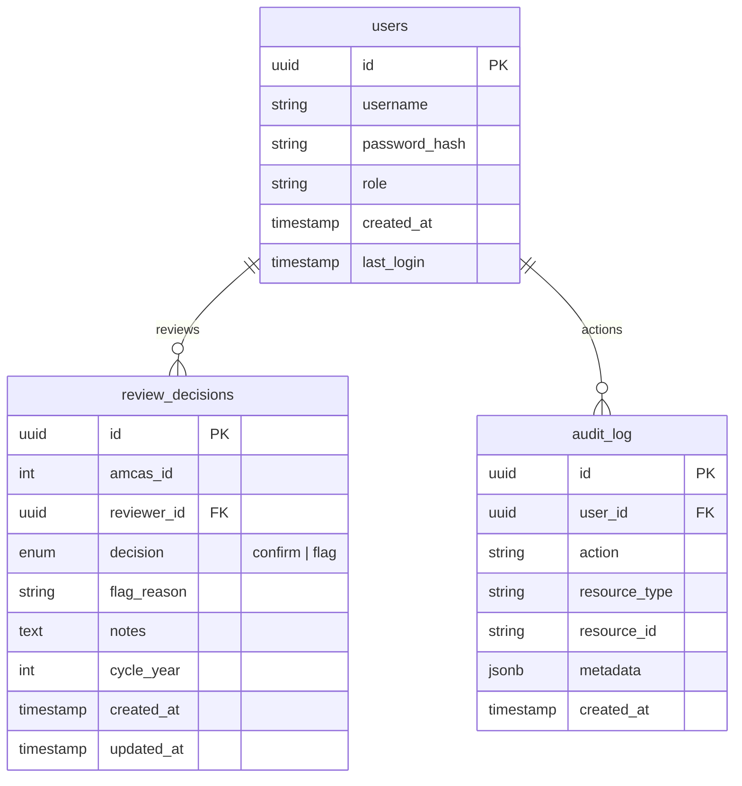

# MVP Reviewer Score-Serving Experience

## Overview

Build the minimum viable product for serving AI triage scores to medical school review committee members each application cycle. Reviewers log in, see a queue of Tier 2+3 applicants (~4-5K from ~17K), view a rubric scorecard for each, and confirm or flag the AI's score. Admins see everything reviewers see plus SHAP charts, fairness audits, model comparison, and pipeline management.

This is **score-serving only**. Multi-year analytics dashboards, interview/matriculation outcome tracking, and historical pattern analysis are explicitly out of scope — they are future work that builds on this foundation.

## Problem Statement

The current system has the pieces but lacks the glue:

- **No role separation.** Every user sees everything — SHAP charts, fairness audits, pipeline management. Reviewers (non-data-scientists) should see only what helps them make decisions: the rubric scorecard and a confirm/flag workflow.
- **No auth on most endpoints.** The review queue, applicant data, and fairness reports are accessible without authentication. This is a FERPA-adjacent data exposure risk with student medical school applications.
- **Decisions stored in flat JSON files.** Two concurrent reviewers submitting decisions will corrupt data (read-modify-write race condition). No `reviewer_id` or `cycle_year` is recorded.
- **Review queue lacks inline context.** Reviewers see score/confidence/agreement but must click through to a separate page to see the rubric breakdown, breaking their flow.
- **No progress tracking.** Reviewers don't know where they left off. Page reload resets position. No completion state when all applicants are reviewed.

## Proposed Solution

Harden the existing system with role-based access, migrate decisions to PostgreSQL, and refine the review queue UX — all within the current Next.js + FastAPI + PostgreSQL stack. No new services, no new frameworks.

## Technical Approach

### Architecture

No architectural changes. The plan extends the existing stack:

- **Frontend:** Next.js 16 (App Router, client components, Tailwind, Recharts)
- **Backend:** FastAPI with SQLAlchemy + Alembic (PostgreSQL), Celery + Redis
- **Auth:** JWT in httpOnly cookies, `users` table with `role` column (already exists)
- **Data flow:** In-memory `DataStore` loads CSVs/PKLs at startup → API serves predictions → frontend renders

### Implementation Phases

#### Phase 1: Security & Role Enforcement (Critical — Do First)

Fix the auth and authorization gaps before anything else. Currently, most API endpoints have zero authentication.

**Backend auth hardening:**

- [ ] Add `Depends(get_current_user)` to every router that currently lacks it:
  - [review.py](api/routers/review.py) — all 4 endpoints
  - [applicants.py](api/routers/applicants.py) — both endpoints
  - [stats.py](api/routers/stats.py) — overview endpoint
  - [fairness.py](api/routers/fairness.py) — report endpoint
  - [triage.py](api/routers/triage.py) — summary and run endpoints
- [ ] Create a `require_admin` dependency in [dependencies.py](api/dependencies.py) that wraps `get_current_user` and checks `user.role == "admin"`. Apply to:
  - `GET /api/fairness/report`
  - `POST /api/triage/run`
  - All `/api/ingest/*` endpoints (already have `get_current_user`, add admin check)
  - All `/api/pipeline/*` endpoints (already have `get_current_user`, add admin check)
- [ ] Add server-side validation to `ReviewDecision` in [review.py models](api/models/review.py):
  - Constrain `decision` to `Literal["confirm", "flag"]`
  - Validate `flag_reason` against `FLAG_REASONS` when `decision == "flag"`
  - Require `flag_reason` when `decision == "flag"`
  - Add `min_length=10` for "Other" notes text
- [ ] Strip SHAP data from `GET /api/applicants/{id}` response when `user.role != "admin"` — return empty `shap_drivers: []` and `class_probabilities: []` for staff users

**Frontend role gating:**

- [ ] Store user role in a React context provider (from `getMe()` response, which already returns `role`). Create `UserContext` in `frontend/contexts/user-context.tsx`
- [ ] Update [sidebar.tsx](frontend/components/ui/sidebar.tsx) to filter `navItems` by role:
  - **Reviewer (staff):** Dashboard, Review, Applicants (3 items)
  - **Admin:** All 7 items (Dashboard, Applicants, Ingest, Pipeline, Review, Fairness, Compare)
- [ ] Update [login page](frontend/app/login/page.tsx) default redirect:
  - `staff` role → `/review`
  - `admin` role → `/`
  - (Currently hardcoded to `/ingest` on line 16)
- [ ] Conditionally hide SHAP sections on [applicant detail page](frontend/app/applicants/[id]/page.tsx) when `role !== "admin"`:
  - Hide "Score Drivers (SHAP)" card
  - Hide "Classification Confidence" card
  - Keep rubric scorecard, score summary, and flag/confirm UI

**Files to modify:**

| File | Change |
|------|--------|
| [api/dependencies.py](api/dependencies.py) | Add `require_admin` dependency |
| [api/routers/review.py](api/routers/review.py) | Add `Depends(get_current_user)` to all endpoints |
| [api/routers/applicants.py](api/routers/applicants.py) | Add `Depends(get_current_user)`, strip SHAP for staff |
| [api/routers/stats.py](api/routers/stats.py) | Add `Depends(get_current_user)` |
| [api/routers/fairness.py](api/routers/fairness.py) | Add `Depends(require_admin)` |
| [api/routers/triage.py](api/routers/triage.py) | Add auth, admin-only for `POST /run` |
| [api/models/review.py](api/models/review.py) | Add validation constraints |
| [frontend/contexts/user-context.tsx](frontend/contexts/user-context.tsx) | **New file** — UserContext provider |
| [frontend/app/layout.tsx](frontend/app/layout.tsx) | Wrap with UserProvider |
| [frontend/components/ui/sidebar.tsx](frontend/components/ui/sidebar.tsx) | Role-based nav filtering |
| [frontend/app/login/page.tsx](frontend/app/login/page.tsx) | Role-based redirect |
| [frontend/app/applicants/[id]/page.tsx](frontend/app/applicants/[id]/page.tsx) | Conditional SHAP rendering |

**Acceptance criteria:**

- [ ] Unauthenticated requests to `/api/review/queue` return 401
- [ ] Staff user calling `GET /api/fairness/report` returns 403
- [ ] Staff user viewing `/applicants/{id}` sees rubric but no SHAP chart
- [ ] Staff user sidebar shows only Dashboard, Review, Applicants
- [ ] Staff login redirects to `/review`; admin login redirects to `/`
- [ ] Submitting `decision: "banana"` returns 422 validation error
- [ ] Submitting `decision: "flag"` without `flag_reason` returns 422

---

#### Phase 2: Data Persistence Migration (Critical — Do Second)

Move review decisions from flat JSON files to PostgreSQL. This fixes the race condition with concurrent reviewers and enables proper querying.

**New SQLAlchemy model:**

```python
# api/db/models.py

decision_enum = Enum("confirm", "flag", name="review_decision_type")

class ReviewDecision(Base):
    __tablename__ = "review_decisions"
    __table_args__ = (
        Index("ix_review_decisions_cycle_amcas", "cycle_year", "amcas_id"),
        Index("ix_review_decisions_reviewer", "reviewer_id"),
        # One decision per reviewer per applicant per cycle
        Index(
            "uq_review_decisions_reviewer_applicant_cycle",
            "reviewer_id", "amcas_id", "cycle_year",
            unique=True,
        ),
    )

    id = Column(UUID(as_uuid=True), primary_key=True, default=uuid.uuid4)
    amcas_id = Column(Integer, nullable=False)
    reviewer_id = Column(UUID(as_uuid=True), ForeignKey("users.id", ondelete="SET NULL"), nullable=True)
    decision = Column(decision_enum, nullable=False)
    flag_reason = Column(String(255), nullable=True)
    notes = Column(Text, nullable=True)
    cycle_year = Column(Integer, nullable=False)
    created_at = Column(DateTime(timezone=True), nullable=False, default=_utcnow)
    updated_at = Column(DateTime(timezone=True), nullable=False, default=_utcnow, onupdate=_utcnow)

    reviewer = relationship("User")
```

**Migration and service updates:**

- [ ] Add `ReviewDecision` model to [api/db/models.py](api/db/models.py)
- [ ] Create Alembic migration: `alembic revision --autogenerate -m "add review_decisions table"`
- [ ] Update [review_service.py](api/services/review_service.py):
  - `save_decision()` — upsert to PostgreSQL instead of JSON file write. Accept `reviewer_id` and `cycle_year` parameters.
  - `get_review_queue()` — join with `review_decisions` table to get decision status per applicant
  - `get_flag_summary()` — query PostgreSQL instead of reading JSON file
  - Keep `_append_flag()` writing to `flags_current_cycle.json` as a secondary export for the annual retrain pipeline (read from DB, write to JSON on demand)
- [ ] Update [review router](api/routers/review.py) `submit_decision` endpoint to pass `current_user.id` and `cycle_year` to `save_decision()`
- [ ] Add a new endpoint `GET /api/review/progress` returning `{total_in_queue, reviewed_count, flagged_count, confirmed_count}` queried from the `review_decisions` table
- [ ] Log old decision to `audit_log` table when a decision is updated (upsert overwrites)
- [ ] Add a data migration script to import existing `review_decisions.json` and `flags_current_cycle.json` into the new table (one-time migration)

**Files to modify:**

| File | Change |
|------|--------|
| [api/db/models.py](api/db/models.py) | Add `ReviewDecision` model |
| `api/db/migrations/versions/xxx_add_review_decisions.py` | **New file** — Alembic migration |
| [api/services/review_service.py](api/services/review_service.py) | Rewrite to use PostgreSQL |
| [api/routers/review.py](api/routers/review.py) | Pass user context, add `/progress` endpoint |
| `api/scripts/migrate_decisions.py` | **New file** — One-time JSON→DB migration |

**Acceptance criteria:**

- [ ] Two concurrent `POST /api/review/{id}/decision` requests don't corrupt data
- [ ] `reviewer_id` and `cycle_year` recorded on every decision
- [ ] Changing a decision (confirm→flag) logs old decision in `audit_log`
- [ ] `GET /api/review/progress` returns accurate counts
- [ ] Existing JSON decisions are migrated to PostgreSQL



---

#### Phase 3: Review Queue UX Improvements (Important — Do Third)

Make the review queue the best it can be for someone reviewing 4,000+ applicants in a cycle.

**Inline rubric scorecard:**

- [ ] Expand the `ReviewQueueItem` API response to include rubric scorecard data. Add a `rubric_scorecard` field to the queue endpoint response (per-applicant rubric data is already computed in `DataStore.rubric_scores`). To avoid a multi-MB payload for 5K items, **do not** include rubric in the queue list — instead, fetch it on-demand when an applicant is displayed
- [ ] Add `GET /api/review/queue/{amcas_id}/detail` endpoint that returns rubric scorecard for the currently-viewed applicant (lighter than the full `/applicants/{id}` detail endpoint — no SHAP, no class probabilities)
- [ ] Render `RubricScorecardView` component inline on the [review page](frontend/app/review/page.tsx) below the score/confidence/agreement row, using the existing [rubric-scorecard.tsx](frontend/components/applicant/rubric-scorecard.tsx) component. Use existing 3-group taxonomy (Personal Statement, Experience Quality, Secondary Essays) since it already works

**Progress and resume:**

- [ ] Replace local progress counter with server-side `GET /api/review/progress` data
- [ ] On page load, auto-advance to the first unreviewed applicant in the queue (skip already-reviewed items). The queue endpoint already returns `decision` per item — find the first `null` decision and set `currentIdx` to that position
- [ ] Show completion state when all queue items have decisions: "All [N] applicants reviewed. [X] confirmed, [Y] flagged." with a summary card
- [ ] Add keyboard shortcuts for high-volume review:
  - `C` — Confirm score (equivalent to clicking "Confirm Score")
  - `F` — Toggle flag reasons panel
  - `1-5` — Select flag reason by number when panel is open
  - `Enter` — Submit flag
  - `→` / `←` — Next / Previous applicant

**Change decision:**

- [ ] When viewing an already-reviewed applicant (decision banner shown), add a "Change Decision" button that re-enables the `FlagIncorrect` component
- [ ] Backend already handles upsert (overwrites by `amcas_id`), so the frontend just needs to allow re-submission

**Concurrent reviewer awareness:**

- [ ] When the queue endpoint returns a decision with a `reviewer_id` that is not the current user, show a subtle notice: "Reviewed by [username] [time ago]" below the decision banner
- [ ] Extend `ReviewQueueItem` response to include `reviewer_username` when a decision exists

**Files to modify:**

| File | Change |
|------|--------|
| [api/routers/review.py](api/routers/review.py) | Add `/queue/{amcas_id}/detail` and `/progress` endpoints |
| [api/services/review_service.py](api/services/review_service.py) | Add `get_applicant_review_detail()` and `get_progress()` functions |
| [frontend/app/review/page.tsx](frontend/app/review/page.tsx) | Inline rubric, auto-resume, keyboard shortcuts, completion state |
| [frontend/lib/api.ts](frontend/lib/api.ts) | Add `getReviewDetail()` and `getReviewProgress()` API calls |
| [frontend/lib/types.ts](frontend/lib/types.ts) | Extend `ReviewQueueItem` with `reviewer_username` |

**Acceptance criteria:**

- [ ] Rubric scorecard displays inline below score row on review page (no page navigation needed)
- [ ] Refreshing the review page resumes at the first unreviewed applicant
- [ ] Pressing `C` confirms the current applicant and advances
- [ ] All-reviewed state shows completion summary
- [ ] "Change Decision" button appears on previously-reviewed applicants
- [ ] Shows "Reviewed by Dr. Smith" when another reviewer has already reviewed

---

#### Phase 4: Dashboard Flag Summary (Important — Do Fourth)

Give admins visibility into review progress and flag patterns.

- [ ] Call `GET /api/review/flag-summary` (already exists in [review router](api/routers/review.py)) from the [dashboard page](frontend/app/page.tsx)
- [ ] Call `GET /api/review/progress` (added in Phase 2) from the dashboard
- [ ] Add a "Review Progress" card showing: total in queue, reviewed count (with progress bar), confirmed count, flagged count
- [ ] Add a "Flag Summary" card showing: total flags, horizontal bar chart of flag reasons (using Recharts `BarChart`, consistent with existing [tier-chart.tsx](frontend/components/charts/tier-chart.tsx) patterns), percentage flagged
- [ ] For reviewer role: show only their personal progress (filter by `reviewer_id`). For admin: show aggregate across all reviewers

**Files to modify:**

| File | Change |
|------|--------|
| [frontend/app/page.tsx](frontend/app/page.tsx) | Add Review Progress and Flag Summary cards |
| [frontend/lib/api.ts](frontend/lib/api.ts) | Add `getFlagSummary()` and `getReviewProgress()` calls |
| [api/routers/review.py](api/routers/review.py) | Add `reviewer_id` filter param to `/progress` and `/flag-summary` |

**Acceptance criteria:**

- [ ] Dashboard shows review progress bar (e.g., "1,247 / 4,312 reviewed")
- [ ] Dashboard shows flag reason breakdown as horizontal bar chart
- [ ] Admin sees aggregate; reviewer sees personal progress

---

#### Phase 5: Polish & Edge Cases (Do Last)

- [ ] **JWT expiry handling:** Add a global fetch interceptor in [api.ts](frontend/lib/api.ts) that detects 401 responses and shows a re-auth modal instead of silently failing. Store pending decision in `localStorage` and re-submit after re-login
- [ ] **"Other" text validation:** Require minimum 10 characters for "Other" flag reason notes (frontend + backend validation)
- [ ] **Empty queue state:** When no Tier 2+3 applicants exist (e.g., pipeline hasn't run), show a clear message: "No applicants in the review queue. An admin needs to run the triage pipeline first."
- [ ] **Applicants page for reviewers:** Hide the "Show all tiers" toggle for staff users — reviewers should only see Tier 2+3 on the applicants table as well
- [ ] **Loading states:** Add skeleton loaders to the review page while rubric data fetches (the queue loads fast, but the per-applicant detail fetch may lag)

**Acceptance criteria:**

- [ ] Session expiry mid-review shows re-auth modal (not a red error box)
- [ ] "Other" reason with 3 characters shows validation error
- [ ] Empty queue shows clear instructions, not a blank page
- [ ] Staff cannot toggle "Show all tiers" on applicants page

## Alternative Approaches Considered

| Approach | Why Rejected |
|----------|--------------|
| **Build reviewer and admin as separate apps** | Over-engineered. Superset pattern (admin sees reviewer UI + extras) is simpler and avoids duplicating components. One codebase, one deployment. |
| **SSE/WebSocket for real-time queue updates** | The pipeline runs 1-2 times per cycle. Concurrent reviewer updates are nice-to-have but not critical for MVP. Polling or manual refresh is sufficient. |
| **Load full rubric data in queue payload** | 5K applicants × 21 dimensions = 105K rubric scores in one response. Fetching on-demand per displayed applicant is lighter and fast enough (single SQL/dict lookup). |
| **Assign applicants to specific reviewers** | Adds significant complexity (queue partitioning, rebalancing on reviewer absence). For MVP, "last write wins" with awareness ("Reviewed by...") is acceptable. Add reviewer assignment in a future phase. |
| **Move all data to PostgreSQL** | The ML pipeline reads CSV/PKL files. Migrating to DB-backed ML data would require rewriting `data_ingestion.py`, `feature_engineering.py`, etc. Not worth it for MVP. Only review decisions move to PostgreSQL. |

## Acceptance Criteria

### Functional Requirements

- [ ] Staff user logs in and lands on `/review` with a queue of Tier 2+3 applicants
- [ ] Admin user logs in and lands on `/` (dashboard) with full navigation
- [ ] Reviewer sees rubric scorecard inline in review queue (no SHAP)
- [ ] Admin sees rubric scorecard + SHAP on applicant detail page
- [ ] "Confirm Score" and "Flag as Incorrect" persist to PostgreSQL with `reviewer_id` and `cycle_year`
- [ ] Dashboard shows review progress and flag summary
- [ ] Sidebar navigation is role-filtered

### Non-Functional Requirements

- [ ] All endpoints serving applicant data require authentication (JWT)
- [ ] Admin-only endpoints return 403 for staff users
- [ ] Concurrent decision submissions don't corrupt data (PostgreSQL upsert)
- [ ] Review page loads in < 2s on institutional network
- [ ] Per-applicant rubric fetch completes in < 500ms

### Quality Gates

- [ ] `bun test` passes for frontend components
- [ ] `pytest` passes for backend endpoints (add tests for auth, role gating, decision persistence)
- [ ] Manual walkthrough: staff login → review 5 applicants → confirm 3, flag 2 → logout → login → resume at position 6
- [ ] Manual walkthrough: admin login → dashboard shows progress → view applicant with SHAP → access fairness page

## Dependencies & Prerequisites

| Dependency | Status | Notes |
|------------|--------|-------|
| PostgreSQL running | Ready | Already configured via Docker Compose and Alembic |
| `users` table with `role` column | Ready | Exists in [api/db/models.py](api/db/models.py) with `admin`/`staff` roles |
| Seed users | Ready | [seed_users.py](api/scripts/seed_users.py) creates admin/staff accounts |
| `get_current_user` dependency | Ready | Exists in [api/dependencies.py](api/dependencies.py), just not applied to most routers |
| Rubric scores loaded at startup | Ready | `DataStore.rubric_scores` populated from `rubric_scores_v2.json` |
| `RubricScorecardView` component | Ready | Exists in [rubric-scorecard.tsx](frontend/components/applicant/rubric-scorecard.tsx) |
| `FlagIncorrect` component | Ready | Exists in [flag-incorrect.tsx](frontend/components/applicant/flag-incorrect.tsx) with reason picker |

## Risk Analysis & Mitigation

| Risk | Likelihood | Impact | Mitigation |
|------|-----------|--------|------------|
| JSON→DB migration loses decisions | Low | High | Run migration script against a copy first. Keep JSON files as backup. Verify counts match. |
| Reviewers dislike new workflow | Medium | Medium | Ship Phase 1+2 first (auth + persistence). Get feedback before Phase 3 UX changes. The rubric grouping can be adjusted. |
| 5K-item queue performance | Low | Medium | Queue is filtered server-side (only Tier 2+3). Rubric fetched on-demand per item. Monitor response times. |
| JWT expiry during review | High | Low | Phase 5 adds re-auth modal. For earlier phases, the 8-hour expiry covers a full work day. |
| Concurrent reviewer conflicts | Medium | Low | "Last write wins" with awareness notice is acceptable for MVP. True assignment/locking is future work. |

## Future Considerations

These are **explicitly out of scope** for this MVP but inform the architecture decisions:

- **Multi-year analytics dashboard:** Track scoring patterns across 2022-2026+ cycles. Requires historical decision data in PostgreSQL (enabled by Phase 2 migration).
- **Interview/matriculation outcome tracking:** Import outcome data, compare AI predictions vs actual results. Requires a new `outcomes` table and import flow.
- **Application profile summary by AMCAS ID:** Rich applicant profiles with demographics, experience hours, essay excerpts, and structured attributes. Requires expanding the `GET /api/applicants/{id}` response.
- **Reviewer assignment:** Partition the queue so reviewers don't overlap. Requires a queue management system.
- **Annual retrain pipeline:** Use accumulated flags + outcomes to retrain models. The `--retrain-with-feedback` CLI flag described in the brainstorm.
- **Tier 1 escalation queue:** Senior reviewers see borderline applicants. Requires a separate queue with different criteria.

## References & Research

### Internal References

- Brainstorm: [reviewer-experience-brainstorm.md](docs/brainstorms/2026-02-13-reviewer-experience-brainstorm.md) — rubric scorecard design, flag reasons, annual retrain pipeline
- Brainstorm: [amcas-ingestion-ui-brainstorm.md](docs/brainstorms/2026-02-13-amcas-ingestion-ui-brainstorm.md) — backend architecture, database schema, auth patterns
- Existing review service: [review_service.py](api/services/review_service.py) — current JSON-based decision storage
- Existing review page: [review/page.tsx](frontend/app/review/page.tsx) — current sequential queue UI
- Existing scorecard: [applicants/[id]/page.tsx](frontend/app/applicants/[id]/page.tsx) — SHAP + rubric detail view
- DB models: [api/db/models.py](api/db/models.py) — User, UploadSession, PipelineRun, AuditLog
- Flag reasons: [frontend/lib/types.ts](frontend/lib/types.ts) — `FLAG_REASONS` constant (line 128)

### SpecFlow Analysis Summary

The SpecFlow analysis identified 27 gaps across 7 categories. The critical ones addressed in this plan:

1. **No auth on review/applicant/fairness/stats endpoints** → Phase 1
2. **No role-based access control (frontend or backend)** → Phase 1
3. **Decisions stored in flat JSON with race conditions** → Phase 2
4. **No `reviewer_id` or `cycle_year` on decisions** → Phase 2
5. **No inline rubric in review queue** → Phase 3
6. **Progress counter resets on reload** → Phase 3
7. **No flag summary on dashboard** → Phase 4
8. **JWT expiry silently fails** → Phase 5
